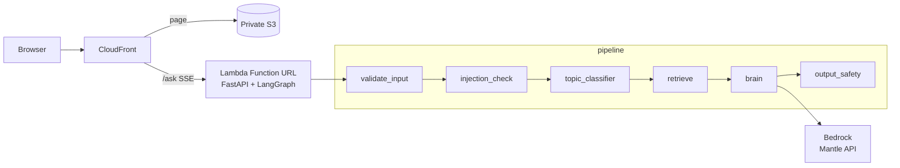

# cadre

Live at **[cadre.marcuss.pro](https://cadre.marcuss.pro)**.

A guardrailed streaming support chatbot for [Cadre AI](https://www.cadreai.com).
The backend is a LangGraph pipeline — deterministic input validation, injection
check, topic classifier, retrieval seam, brain, output safety — running on
FastAPI in a Lambda container, calling Bedrock models over its OpenAI-compatible
Mantle endpoint ([ADR 0002](adr/0002-bedrock-mantle-api-key.md)). Every pipeline
step streams its verdict live to the browser as SSE, so the UI renders the
guardrails as they run, not a spinner. Every turn links its public **Langfuse
trace** ("View trace ↗") — one span per pipeline step, carrying the exact
per-step latencies the stepper showed.



## Quickstart

Run locally (backend container + web dev server):

```bash
docker build -t cadre-backend:local backend
docker run --rm -p 8080:8080 -e AWS_BEARER_TOKEN_BEDROCK cadre-backend:local
cd web && npm ci && npm run dev        # http://localhost:8088, proxies to :8080
```

Unit tests:

```bash
cd backend && pip install -r requirements-dev.txt && pytest
cd web && npm ci && npm test && npm run typecheck
```

E2E against a real target (details: `backend/tests/e2e/README.md`):

```bash
cd backend && BASE_URL=http://localhost:8080 pytest -m e2e
cd backend && CADRE_E2E_BEDROCK=1 BASE_URL=https://cadre.marcuss.pro pytest -m e2e
```

## Repo tour

| Path | What it is |
|---|---|
| [`plan.md`](plan.md) | The epic: architecture, model roster, phases (1–2 shipped, 3–6 not built), scope decisions |
| [`adr/`](adr/README.md) | Architecture decision records — the load-bearing traps and choices |
| [`kb/learnings.json`](kb/learnings.json) | Compounding knowledge base; every cycle reads it, appends to it |
| [`.claude/`](.claude/) | Compound workflow: skills, agents, kanban recipe driving issue → PR |
| [`backend/`](backend/CLAUDE.md) | FastAPI + LangGraph engine (rules in `backend/CLAUDE.md`) |
| [`web/`](web/CLAUDE.md) | React/Vite SSE client + live stepper (rules in `web/CLAUDE.md`) |
| [`infra/`](infra/README.md) | Terraform: CloudFront, Lambda, S3, OIDC — no static AWS credentials |
| [`docs/`](docs/index.md) | MkDocs site → [published docs](https://nextasy-apps-llc.github.io/marcuss-cadre-test/) |

**Reviewing this submission?** Start with
[`docs/review.md`](docs/review.md) — a 10-minute demo script plus a map from
each evaluation dimension to the evidence for it in this repo.
