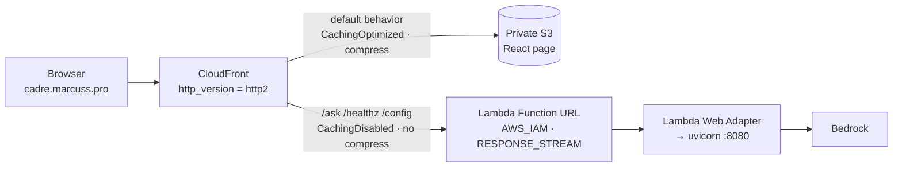
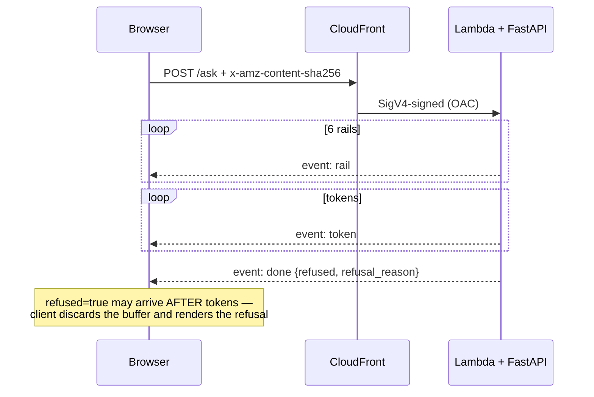

# ADR 0001 — Streaming chatbot on one CloudFront distribution, IAM-only Lambda, zero secrets

- **Status:** Accepted
- **Date:** 2026-08-07

## Context

`cadre` is a guardrailed chatbot at `cadre.marcuss.pro`: a React page plus a
`POST /ask` streaming SSE (`rail` → `token` → `done`) from a Bedrock-backed
FastAPI app. Same AWS account and conventions as `marcuss.pro`: OIDC-only CI,
no long-lived keys, public repo.

Two constraints rule out API Gateway + Lambda + S3/CloudFront:

- **It must actually stream.** API Gateway HTTP APIs, any non-disabled cache
  policy, and gzip/br compression each buffer the whole response — streaming
  silently becomes one blob at the end. (`ask-marcus` on `marcuss.pro` fakes
  streaming client-side because it sits behind such a path.)
- **The Function URL can't be anonymous.** The org data perimeter 403s
  `NONE`-auth Function URLs; every call must be SigV4-signed.

Most settings below look optional until one is flipped and streaming breaks
silently.

## Decision

### 1. One CloudFront distribution, two origins, one hostname

- `infra/cloudfront.tf`: S3 is the default behavior; `local.api_paths` are
  `ordered_cache_behavior` entries on the Lambda origin.
- One hostname ⇒ `fetch("/ask")` is same-origin, so no CORS preflight sits in
  front of the SSE connection; `CORSMiddleware` serves local dev only.
- Two OACs, one per origin type (`…origin_access_control.lambda` / `.s3`) —
  one OAC cannot front both.

### 2. RESPONSE_STREAM Function URL + Lambda Web Adapter, never API Gateway

- `invoke_mode = "RESPONSE_STREAM"` (`infra/lambda.tf`) +
  `AWS_LWA_INVOKE_MODE=response_stream` with the Lambda Web Adapter extension
  (`public.ecr.aws/awsguru/aws-lambda-adapter:0.9.1`) in `backend/Dockerfile`.
  The adapter fronts uvicorn, so one image runs both under `docker run` and in
  Lambda.
- **No API Gateway anywhere.** HTTP APIs re-buffer whatever the adapter does.

Four silent-failure traps (mirrored in `infra/README.md`, "Things that will
silently break streaming" — keep both in sync):

| Setting | Why |
|---|---|
| `cache_policy_id = Managed-CachingDisabled` on the API behaviors | Any non-zero TTL makes CloudFront buffer the response to store it. |
| `compress = false` on the API behaviors | Compression buffers the body to compress it. |
| `http_version = "http2"` on the distribution | HTTP/3 (QUIC) severs long SSE mid-response on this edge (`ERR_QUIC_PROTOCOL_ERROR`). `curl` ignores `alt-svc`, so it passes a curl smoke test and breaks every real visitor. |
| `origin_read_timeout` / `origin_keepalive_timeout` on the Lambda origin | Must exceed `var.lambda_timeout_s`, else CloudFront 504s mid-stream. **Committed 60s vs a 120s Lambda timeout — currently violated, see Consequences.** |

### 3. Function URL auth: `AWS_IAM` + OAC — and the two 403s

`authorization_type = "AWS_IAM"`, never `NONE`. CloudFront SigV4-signs every
origin request via the Lambda-typed OAC, which satisfies the perimeter and makes
the URL unreachable except through this distribution. The API behaviors use
`Managed-AllViewerExceptHostHeader` — `Host` must stay the Function URL's own
hostname or the signature won't verify.

**Two grants are required, not one** (`infra/lambda.tf`, both scoped to
`source_arn = aws_cloudfront_distribution.this.arn`):

- `aws_lambda_permission.cloudfront` — `lambda:InvokeFunctionUrl`.
- `aws_lambda_permission.cloudfront_invoke` — `lambda:InvokeFunction`, which
  Function URLs created since **October 2025** additionally require. Without it
  every signed request 403s with the same generic body as a bad signature. This
  — not any org SCP/RCP — was the root cause of the 403 that held the stack up;
  the rest of the OAC wiring was already correct.

**The viewer must hash the payload.** For methods with a body the OAC signature
covers the hash the *viewer* supplies, so a POST without `x-amz-content-sha256`
403s with "signature does not match". GET is exempt; every POST carries it via
`sha256Hex()` in `web/src/lib/useCadreChat.ts` / `sse.ts`.

**Bisecting a Lambda-origin 403:** invoke the URL directly with an in-account
SigV4-signed request (`aws lambda invoke-with-response-stream`, `awscurl`) under
credentials that are *not* the CloudFront principal. Success proves the function
and its resource policy; failure points at the grants above. Re-reading the OAC
config a fifth time distinguishes nothing.

### 4. Zero secrets by design

Lambda → Bedrock is execution-role SigV4 (`aws_iam_role_policy.bedrock`);
Actions → AWS is OIDC only (no `AWS_ACCESS_KEY_ID` in repo secrets);
CloudFront → Lambda/S3 is OAC-signed. So the repo is public with nothing to
hide — `terraform.tfvars` and `backend.hcl` are gitignored as noise, not
secrets.

The first real secret (likely Langfuse) is pre-agreed: `aws_ssm_parameter`,
`type = "SecureString"`, `value = "SET_OUT_OF_BAND"`,
`lifecycle { ignore_changes = [value] }`, written by `aws ssm put-parameter`,
read at container start — out of state and git, rotation without an apply.

### 5. GitHub OIDC only, two separate roles

The provider is looked up, not created (`var.github_oidc_provider_arn`) —
creating a second fails, and importing the shared one would let destroying this
stack take OIDC down account-wide.

- **`cadre-deploy`** (`infra/oidc.tf`): ECR push, `lambda:UpdateFunctionCode`
  + function reads, S3 sync, CloudFront invalidation. Deliberately **excludes**
  `lambda:UpdateFunctionConfiguration` — env vars (model ids,
  `CADRE_ALLOWED_ORIGIN`, brain effort) belong to Terraform, so a compromised
  deploy cannot repoint the model or widen the allowed origin.
- **`cadre-terraform`** (`infra/ci_terraform.tf`): plan/apply. State scoped to
  `…/${state_key}*`, IAM to `${project_name}-*`, so it cannot mint a privileged
  role elsewhere. `ManagedServices` is service-wildcarded on purpose —
  Terraform creates ARNs that don't exist yet; the real control is the
  `production` reviewer gate.

Merged, a compromised deploy run could rewrite IAM or its own environment. Keep
them split.

**Environment-sub trap.** A job in `environment: production` gets
`sub = repo:<repo>:environment:production`, which *replaces* — not adds to —
`repo:<repo>:ref:refs/heads/main`. Omit it and the gated `deploy`/`apply` jobs
die on a bare `sts:AssumeRoleWithWebIdentity` denial while ungated `plan` keeps
working (`actions/runs/31110914078`).

**Two repo spellings.** Tokens carry the name form
(`Nextasy-Apps-LLC/marcuss-cadre-test`) *and* the rename-proof id form
(`…@270195565/…@1324634448`, `var.github_repo_id_form`), so every condition is
(2 spellings) × (sub forms) — `local.gh_repo_forms` iterates both. Listing one
silently drops the other.

### 6. Two-phase custom domain

`aws_acm_certificate.this` is DNS-validated with deliberately **no**
`aws_acm_certificate_validation`: DNS lives in Cloudflare, so nothing here can
publish the CNAME and that resource would just block every apply until timeout.
CloudFront also refuses an alias whose cert isn't `ISSUED`. Hence
`var.enable_custom_domain`: apply `false` (cert `PENDING_VALIDATION`, site live
on `*.cloudfront.net`) → publish `terraform output acm_validation_record` in
Cloudflare → wait for `ISSUED` → apply `true` to attach alias + cert.

The validation record must be **DNS only (grey cloud)**: proxied, it answers
with Cloudflare's IP, ACM never sees its token, and the cert hangs forever with
no error. Production DNS is DNS-only too — the zone disables HTTP/3 because QUIC
severs SSE, and proxying adds a second place that can regress. The variable
defaults to `true` since PR #6 (`f0b174b`); `false` is only for rebuilds.

### 7. Terraform in CI

`.github/workflows/terraform.yml`: `plan` runs on `pull_request` (`infra/**`)
and dispatch, skipping cleanly when `vars.TF_ROLE_ARN` is unset instead of
failing red. `apply` runs only via `workflow_dispatch` + `needs: plan`, inside
`environment: production`, and applies the exact `tfplan-${{ github.run_id }}`
artifact — never re-plans, so moved state refuses rather than applying something
unreviewed. Backend uses `use_lockfile=true` (native S3 locking, Terraform
≥ 1.10), no DynamoDB table. **Bootstrap:** `cadre-terraform` is created *by*
this Terraform, so the first apply runs locally on human admin credentials.

### 8. Immutable ECR tags, deploy-by-SHA, rollback that refuses to build

`image_tag_mutability = "IMMUTABLE"`; `.github/workflows/deploy.yml` is
`workflow_dispatch`-only (shipping is a decision, not a merge side effect),
taking a 40-char SHA plus `action: deploy | rollback`.

- The SHA must be an ancestor of `origin/main` (`git merge-base --is-ancestor`)
  — no deploying an unreviewed branch tip past the PR gate.
- `rollback` skips the build and fails unless the image is already in ECR, so it
  can never ship code that didn't go through CI.
- `lifecycle { ignore_changes = [image_uri] }` on `aws_lambda_function.this` —
  deploys move `image_uri` via `update-function-code`, so without it every apply
  would roll back to `var.image_tag` (`"bootstrap"`).

### 9. Clear the base image's `ENTRYPOINT`

`public.ecr.aws/lambda/python:3.13-arm64` ships `/lambda-entrypoint.sh`, which
treats `CMD[0]` as a handler name. The web adapter speaks the Runtime API here,
so that entrypoint isn't merely redundant — it eats the uvicorn `CMD` and every
invoke dies at init with *"entrypoint requires the handler name to be the first
argument"*. Fix: `ENTRYPOINT []` before `CMD` in `backend/Dockerfile`. It
shipped because `ci.yml`'s `image` job builds but never runs the container and
`update-function-code` succeeds unconditionally, so the post-deploy `/healthz`
smoke is the first step that ever boots the image — a standing gap a
`docker run` check in `ci.yml` would close.

## Consequences

**Good:** no CORS, no second certificate, one invalidation path; real streaming
end-to-end through CDN, origin and IAM; no static AWS credentials, so a leaked
clone leaks nothing; a compromised `cadre-deploy` token ships a bad image but
cannot touch IAM or config; rollback is a restore, so a broken `main` never
blocks recovery.

**Bad / tradeoffs:**

- Streaming is fragile: four settings each defeat it silently, `curl` misses the
  HTTP/3 variant, and no test fails on regression — `infra/README.md` and this
  ADR are the only guardrails.
- OIDC conditions are (2 spellings) × (sub forms), breaking only behind the
  `production` gate: the most expensive place to debug.
- `ManagedServices` is service-wildcarded, so the reviewer gate — a process
  control — is the real boundary.
- Nothing in CI boots the container before production (decision 9).
- **Open:** origin timeouts are 60s against a 120s `lambda_timeout_s`,
  contradicting decision 2's invariant. Align them before a slow turn hits the
  CloudFront timeout first.

## Related

- `infra/README.md` — living operational doc; keep in sync.
- `infra/{cloudfront,lambda}.tf` — 1–3; `web/src/lib/{useCadreChat,sse}.ts` — 3.
- `infra/{oidc,ci_terraform}.tf` — 5; `infra/{acm,variables}.tf` — 6.
- `.github/workflows/{terraform,deploy,ci}.yml` — 7–9; `backend/Dockerfile` — 2, 9.
- `marcuss.pro/adr/0013`, `0015` — the sibling site's deploy ADRs; this stack is
  deliberately more gated (dispatch + approval) because it ships a container and
  a Bedrock-backed API, not static files.
