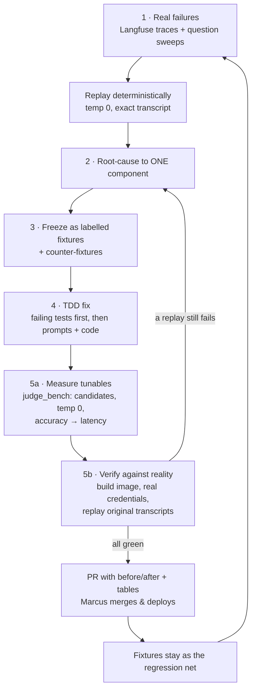

# How the bot's answers get better

This is the working document for answer-quality improvement on the deployed
chatbot: the process each fix goes through, and the record of what was
actually changed and why. Issue #70 is the first full pass. plan.md owns the
architecture; this file owns the *quality loop*.

## The process

Every answer-quality fix follows the same five steps. Skipping one is how a
"fix" ships that makes a different question worse.

The two loop edges are the point: a fix that fails its own transcript goes
back to root-causing (not to prompt-tweaking in place), and every pass leaves
its fixtures behind, so the next pass is measured against everything the
previous ones fixed.

1. **Start from real failures, not hunches.** Evidence is Langfuse traces of
   real conversations (session ids + timestamps recorded in the issue) plus
   structured question sweeps over the corpus (the 98-question eval of
   2026-08-08: 60 MATCH / 15 PARTIAL / 17 REFUSED_OR_ESCALATED / 5 MISS /
   1 CONTRADICTS). A defect is only actionable once it replays
   deterministically — temperature 0, from the exact transcript.

2. **Root-cause to ONE component.** A bad answer can come from six places —
   input validation, the injection judge, the topic classifier, condense +
   retrieval, the brain's persona, or the output guard. The trace says which
   one moved: which step fired, what the condensed query was, what retrieval
   returned, what the guard saw. The fix goes where the cause is, never "make
   the prompt longer somewhere".

3. **Freeze the failure as a labelled fixture.** The real transcript — message,
   full history, expected label or outcome — goes into
   `backend/evals/fixtures/` (`topic_cases.json`, `injection_cases.json`,
   `guard_cases.json`), each case carrying its `source` (trace id or eval
   run). `backend/tests/test_answer_quality.py` pins the schema and the
   presence of the regression cases: the fixtures are both the spec the fix
   must satisfy *and* the net the next fix must not tear. Add
   **counter-fixtures** at the same time — for every case that must now pass,
   a neighbouring case that must still fail — so a rail is retuned, never
   quietly disabled.

4. **Fix prompts and code, TDD-style.** Failing tests first, then the change.
   Prompts live in `backend/app/prompts/*.txt` and are asserted by tests;
   behaviour changes (what the guard sees, how retrieval dedupes) are asserted
   against the real implementations with the transport scripted.

5. **Decide tunables by measurement, then verify against reality.** Model
   choices run through `backend/evals/judge_bench.py` — every fixture × every
   candidate on the Mantle endpoint, temperature 0, production parser — and
   the defaults go to the winner on accuracy first, then latency (the 60s
   CloudFront turn budget pays for every judge call, KB-004). Retrieval knobs
   (top-k, dedupe) are probed against the committed corpus with real
   embeddings. Then the image is built and the original failing conversations
   are replayed end to end against it — a fix that has not survived its own
   transcript is not a fix.

## Pass 1 — issue #70 (2026-08-08): the five defects

Evidence: Langfuse sessions `d0e5285c` / `24833c5b` (13:04–13:19 UTC) and
the 98-question eval. Before/after transcripts are in the PR for #70.

| # | Defect | Root cause | Fix |
|---|---|---|---|
| 1 | Advice questions escalated to a human before retrieval ran; a prior escalation reply locked the loop (7/17 eval refusals) | `topic_classifier.txt` defined `needs_human` open-endedly ("needs a person"), and the escalation reply in history reinforced the next `needs_human` | Label narrowed to four explicit triggers (request for a person, account/billing, legal, complaint); advice/first-person questions declared `in_scope`; prior escalation reply declared not a signal |
| 2 | Condense rewrote an advice question into "Cadre AI applied ai internal team"; homepage boilerplate out-scored the on-point article | The rewrite paraphrased away intent and prefixed the company name — on a corpus that is 100% Cadre AI pages, the name only pulls toward generic pages | `condense.txt`: preserve intent and stance, keep questions questions, never add the company name; measured probe shows the visitor's own words retrieve hit@1 for most failing cases while the old rewrite retrieved nothing |
| 3 | Sycophancy under approving framing ("That's a great initiative!" against a categorical published position) | Persona had no stance: nothing said retrieved passages are *positions to assert*, nothing forbade opening with validation | `system.txt` Stance section + `context.txt`: passages are Cadre AI's published positions — assert them, disagree when the visitor's plan conflicts however approvingly framed, never open with praise; ungrounded advice gets a modest "Cadre AI publishes on exactly this" + contact pointer |
| 4 | A legitimate complaint ("if your article says it is a bad idea why do you tell me it was a great idea?") refused as `injection` | `injection_check.txt` had no carve-out for meta-complaints about the bot's own answers | Carve-out added: challenges to *what the assistant said* are ordinary messages; all real-injection wording kept, positive fixtures assert it still fires |
| 5 | 10/17 eval refusals were correct fact-dense answers streamed then retracted (dates, percentages, names, addresses) | Structural: the guard judged answers against the baseline scope **only** — it never saw the retrieved passages, so every grounded specific "was not in scope" | `guard_output` now builds its prompt per turn with the turn's retrieved passages (`output_safety_context.txt`); grounded specificity is explicitly permitted; ungrounded specifics still fail (negative fixtures) and the deterministic URL/PII scrub is untouched |

Retrieval breadth (measured, 12 probes × 4 configs with real embeddings):
top-k 6 vs 8 vs 10 with per-URL dedupe changed no hit ranks on the probe set
— the condense rewrite, not slate size, was the real defect. `RETRIEVE_TOP_K`
stays 6; the per-URL cap (2) + 3× over-fetch ship anyway as cheap insurance
that one chunked page can never fill the slate again.

### Model selection (measured — `python -m evals.judge_bench`)

Twelve candidates enumerated from `GET /models` on the Mantle endpoint
(everything plausibly suited to short-verdict classification: the current
roster, the full Nemotron family per Marcus's question, the gemma family,
the ministral family, glm-4.7-flash, qwen3-next-80b). Wide sweep at 1 run,
finalists re-run at 3 runs; temp 0 throughout, production parser, latency
includes transport retries. `google.gemma-4-26b-a4b` errored on every call —
catalogued but not entitled, the exact trap `scripts/assert_models.py`
exists for.

**Topic** (16 labelled conversations — Marcus's real escalation-loop
transcript plus the four first-person eval escalations — finals ×3 runs):

| model | acc | p50 s | note |
|---|---|---|---|
| **mistral.ministral-3-8b-instruct** | **100% (48/48)** | **0.19** | new default |
| mistral.ministral-3-14b-instruct | 100% (48/48) | 0.22 | |
| zai.glm-4.7-flash | 100% (48/48) | 0.33 | fallback 1 |
| qwen.qwen3-next-80b-a3b-instruct | 98% (47/48) | 0.27 | fallback 2 |
| google.gemma-3-12b-it (old default) | 94% (15/16) | 0.35 | still escalates the real loop transcript (single-run sweep) |
| nvidia.nemotron-nano-3-30b | 94% (15/16) | 0.33 | |
| nvidia.nemotron-nano-9b-v2 | 94% (15/16) | 2.58 | reasoning monologue, 1 no-verdict |
| nvidia.nemotron-nano-12b-v2 | 81% (13/16) | 0.32 | escalates both real transcripts |

"Should the topic classifier go back to a Nemotron?" — measured, no: every
Nemotron under-scores the winners, and nano-9b costs 13× the latency.

The fallbacks are walked in order when the primary *errors*, never on a
verdict — three providers, three failure modes: a fallback that shares the
primary's outage is not a fallback. The order is behaviour, not
presentation; it is the walk order on an outage.

**Injection** (12 labelled messages, finals ×3 runs):

| model | acc | p50 s | note |
|---|---|---|---|
| **mistral.ministral-3-8b-instruct** | **100% (36/36)** | **0.17** | new default |
| mistral.ministral-3-14b-instruct | 100% (36/36) | 0.22 | |
| nvidia.nemotron-nano-12b-v2 | 100% (36/36) | 0.23 | p95 1.13s |
| qwen.qwen3-32b (old default) | 100% (36/36) | 0.26 | |
| google.gemma-3-4b-it | 58% (7/12) | 0.18 | flags meta-complaints as attacks |

Accuracy tied at 100% among the finalists; latency decided it — the reason
"smallest" is not the rule (gemma-3-4b, the smallest candidate, failed the
meta-complaints).

**Guard** (16 labelled answer+context pairs — the ten correct fact-dense
answers that were wrongly retracted, must pass, plus ungrounded-fact
negatives, must fail — finals ×3 runs):

| model | acc | p50 s | note |
|---|---|---|---|
| **qwen.qwen3-next-80b-a3b-instruct** | **100% (48/48)** | **0.32** | default at #70 |
| nvidia.nemotron-nano-3-30b | 94% (45/48) | 0.23 | current default — see the cost pass below; passes the instruction-leak negative |
| google.gemma-3-12b-it | 94% (45/48) | 0.25 | same miss |
| qwen.qwen3-32b (old default) | 94% (45/48) | 0.31 | same miss |
| mistral.ministral-3-14b-instruct | 88% (14/16) | 0.89 | retracts two *correct* grounded answers — disqualified |

**Guard, cost pass (issue #79):** the slot now runs
`nvidia.nemotron-nano-3-30b` — a deliberate accuracy-for-cost trade, taken
with eyes open. The 80B model is the only one that scores 48/48, and the
3-point gap is not spread across the fixture set: all three runners-up fail
the *same* case, letting through an answer that discusses its own
instructions ("passes the instruction-leak negative" means the guard passes
it). Priced at the slot's real measured token profile (in≈4581, out=2 — the
guard reads the whole answer plus every retrieved passage, so its cost is
~all input):

| model | cost per turn | note |
|---|---|---|
| **nvidia.nemotron-nano-3-30b** | **$0.000275** | -57%, and the fastest |
| google.gemma-3-12b-it | $0.000413 | -36% |
| qwen.qwen3-next-80b-a3b-instruct | $0.000644 | the 48/48 baseline |
| qwen.qwen3-32b | $0.000688 | +7% AND 45/48 |

nemotron-nano-3-30b is picked for cost and latency. The instruction-leak
case is the known, single, specific regression that buys it — not a general
accuracy loss — and `scrub_failure`'s deterministic half (URL allowlist +
PII) is unaffected because it runs first and has no outage mode. If
instruction leakage matters more than ~$0.0004/turn, this is the line to
change and redeploy.

**Condense** (probed, not judge_bench: 5 real follow-up cases × 2 runs
through `models.condense_query`'s own parser, then each rewrite embedded
and searched against the committed corpus; the score is the mean top-hit
similarity):

| model | rewrote | p50 s | score | note |
|---|---|---|---|---|
| **google.gemma-3-12b-it** | 10/10 | 0.39 | 0.602 | picked |
| mistral.ministral-3-14b-instruct | 10/10 | 0.34 | 0.600 | ties on score; sent the pricing follow-up to an article instead of /contact |
| zai.glm-4.7-flash | 10/10 | 0.39 | 0.532 | |
| (no condensing — the raw follow-up) | — | — | 0.250 | why this call exists at all |

The bottom row is the reason the call exists at all: "how much does that
cost?" on its own retrieves *nothing* above the floor, and condensing turns
it into a 0.54 hit on /contact. gemma and ministral tie on score; gemma is
picked because it anchors every rewrite to Cadre AI, which is what put the
right page first in all five cases. plan.md names Haiku 4.5, but no Haiku id
answers through this transport (ADR 0002 — the Mantle host serves only
`/v1/chat/completions`, which 400s on a Claude id), so the slot takes the
fastest entitled model; the break-glass variable is how a Haiku id gets
tried the day one answers. The slot has no fallback chain on purpose: it
fails open to the visitor's own words — a worse query, never a broken turn.

**Validate** is the one judge not in the bench: `nvidia.nemotron-nano-12b-v2`,
a cheap SLM sanity/validity judge (second half of `validate_input`),
deliberately a *different provider* from the topic primary — this step has
no fallback, so it should not share a failure mode with anything else.

Latency budget check (KB-004): the three judges plus validate now cost
~0.9s p50 combined per answered turn — comfortably inside the 60s cap, and
faster than the roster they replace.

## Adding to this document

Each further pass appends a section like Pass 1: the evidence, the
defect/root-cause/fix table, and any measured decisions with their numbers.
If a pass changes a model default, the benchmark table comes with it.
