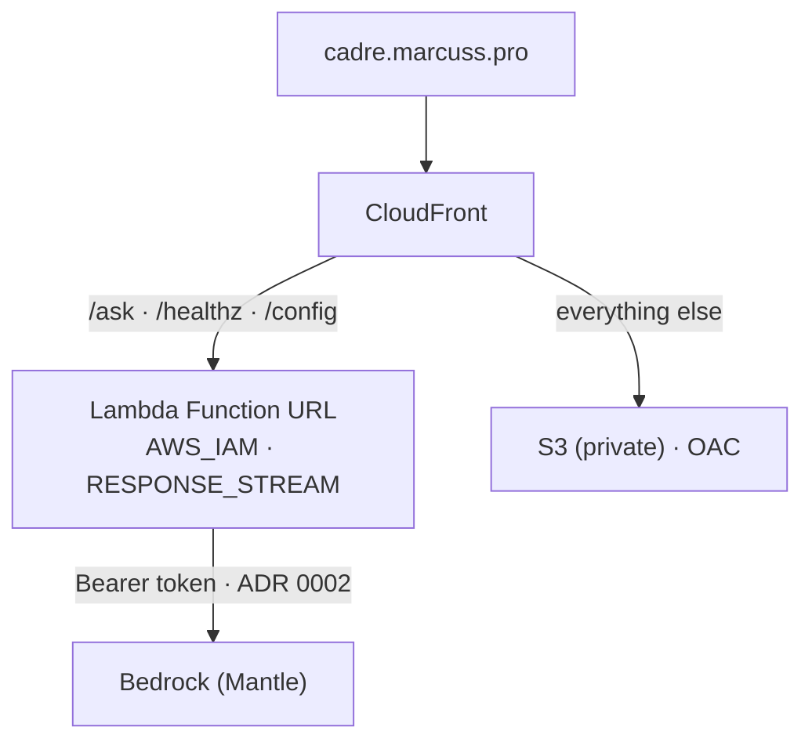

# infra

Terraform for Cadre: an arm64 container Lambda that streams SSE, fronted by
CloudFront, with the page served from a private S3 bucket on the same hostname.

<!-- twin of the diagram in docs/index.md — keep the two byte-identical -->



## Secrets and credentials

**Nothing in this repo is a secret, and no credential is long-lived except the
API keys parked in SSM.** ADR 0001 designed a zero-secret stack; ADR 0002
retracted that for model calls when classic `bedrock-runtime` turned out to be
`NOT_AUTHORIZED` account-wide. What holds by design: every AWS-to-AWS hop is
role- or OAC-based, and every real secret lives in exactly one SSM parameter —
never in git, tfvars, or workflow files:

| Thing | How it authenticates |
|---|---|
| Lambda → Bedrock | Bearer token (Bedrock API key) to the Mantle endpoint — **not** SigV4 ([ADR 0002](https://github.com/Nextasy-Apps-LLC/marcuss-cadre-test/blob/main/adr/0002-bedrock-mantle-api-key.md): classic `bedrock-runtime` is `NOT_AUTHORIZED` account-wide). SSM SecureString `/cadre/bedrock-api-key`, created out of band; Terraform `data`-reads it into `AWS_BEARER_TOKEN_BEDROCK`. The execution role has no `bedrock:*` grant at all. |
| Lambda → Langfuse | Public/secret key pair out of band in SSM (`/cadre/langfuse-public-key`, `/cadre/langfuse-secret-key`) plus plain-String `/cadre/langfuse-base-url`, `data`-read into `LANGFUSE_*`. Tracing fails open, so a wrong value costs the trace link, never the turn. |
| Lambda → OpenAI embeddings | Bearer token to `api.openai.com/v1/embeddings` (one per in-scope turn). SSM SecureString `/cadre/openai-api-key`; `app/embeddings.py` resolves it **per request**, so rotation is an SSM write + one apply, no cold start. Retrieval fails open. |
| GitHub Actions → AWS | OIDC, exact sub-claim pinned to `refs/heads/main`. No access key. |
| CloudFront → Lambda URL | OAC, SigV4-signed. The URL is `AWS_IAM`, not public. |
| CloudFront → S3 | OAC. The bucket blocks all public access. |

`terraform.tfvars` and `backend.hcl` are gitignored only because the account id
and state bucket name are pointless to publish, not because they are
credentials.

**When a new secret appears**, there are two shapes, and picking the wrong one
is how a working credential gets replaced by the string `SET_OUT_OF_BAND`:

*The parameter does not exist yet* — create it with the house placeholder
pattern (ADR 0001 decision 4), never a `.tfvars` value:

```hcl
resource "aws_ssm_parameter" "some_new_key" {
  name  = "/cadre/some-new-key"
  type  = "SecureString"
  value = "SET_OUT_OF_BAND"      # real value via `aws ssm put-parameter`

  lifecycle {
    ignore_changes = [value]     # keeps the secret out of state and out of git
  }
}
```

*The parameter already exists with a real value* — **only read it.** A resource
block here either fails the apply ("already exists") or, once imported, waits to
clobber the live value with the placeholder on some later apply:

```hcl
data "aws_ssm_parameter" "some_existing_key" {
  name            = var.some_existing_key_parameter
  with_decryption = true
}
```

This is what `/cadre/bedrock-api-key`, the three Langfuse parameters and
`/cadre/openai-api-key` all do. Two things follow: a decrypted read puts the
value in Terraform state, so the state bucket is as sensitive as the secret;
and `data` blocks resolve at **plan** time, so every role that plans — not
just the one that applies — needs `ssm:GetParameter` on the ARN, or the plan
dies with `AccessDenied` before it renders a diff. Either way, grant the
execution role `ssm:GetParameter` on that ARN and read the value at container
start — rotation becomes an SSM write with no code change and no apply.

## Model ids are not Terraform inputs

There are no `brain_model` / `judge_model` / `topic_model` variables, and
`lambda.tf` sets no `CADRE_MODEL_*` (issue #84). They existed until they
caused the failure they were supposed to make convenient: a Lambda environment
variable beats the code default, so Terraform — not the deployed image —
decided which model ran, and after the roster was re-benchmarked in
`backend/app/config.py`, production silently kept executing the previous one.
Nothing broke, because every model step fails open.

Each id is chosen by a measurement taken against the prompts in the *same*
commit, so the id and the prompt ship together, in one image, through one
review. `backend/app/config.py`'s `MODEL_DEFAULTS` is the single source of
truth; to change a model, change that file, open a PR, deploy.

`backend/scripts/assert_model_env.py` reads the function's live environment
before every build and fails the deploy on any `CADRE_MODEL_*` — including one
a future `terraform apply` put back. A hand-set override for an incident is
still possible (`aws lambda update-function-configuration`); it is removed by
the next apply, logged at WARNING on boot, and blocks the next deploy until
someone removes it deliberately.

## First apply

Terraform is applied by a human with admin credentials — the CI role can
deploy the app but deliberately cannot change infrastructure, so a compromised
workflow cannot rewrite IAM or repoint the function's environment.

```bash
cp backend.hcl.example backend.hcl              # fill in the state bucket
cp terraform.tfvars.example terraform.tfvars    # fill in account id + OIDC ARN

terraform init -backend-config=backend.hcl
terraform plan
terraform apply
```

`enable_custom_domain` stays `false` for this apply. The stack comes up fully
working on the distribution's own `*.cloudfront.net` domain:

```bash
terraform output site_url
```

## Attaching cadre.marcuss.pro

The first apply already created the certificate, but it cannot validate on its
own: `marcuss.pro`'s DNS is in Cloudflare, not Route 53, so no Terraform
resource can publish the record. Do the rest by hand, in order:

```bash
terraform output acm_validation_record     # 1. read the record
#    2. publish it in Cloudflare as a CNAME — proxy status must be "DNS only"
terraform refresh && terraform output acm_certificate_status   # 3. wait for ISSUED
#    4. then set enable_custom_domain = true in terraform.tfvars and apply again
terraform output dns_cname_target          # 5. Cloudflare CNAME cadre -> this
```

Three pitfalls cost real time here. A **proxied** validation record is the
classic afternoon-killer: Cloudflare answers with its own IP instead of the
CNAME target, ACM never sees its token, and the certificate sits in
`PENDING_VALIDATION` forever with no error that says why — also confirm
Cloudflare did not append the zone twice
(`_x.cadre.marcuss.pro.marcuss.pro`). CloudFront rejects an alias whose
certificate is not yet `ISSUED`, which is why step 4 is a second apply rather
than a flag on the first. And once this has run, **never resync by local
apply**: a leftover `enable_custom_domain = false` silently tears a working
custom domain back to the bare `*.cloudfront.net` — it happened mid-apply on
2026-08-07 (issue #37). A `lifecycle.precondition` now errors on that instead
of applying, and the fix is always CI's
[`Deploy`](#releasing), which never passes the override. Point the hostname
with **DNS only**: proxying re-enables HTTP/3, which severs long-lived SSE
streams (this zone keeps HTTP/3 off deliberately); if you proxy anyway,
SSL/TLS mode must be **Full (strict)**. Finally, verify in a browser, not
curl — `curl` ignores `alt-svc`, so it passes even when HTTP/3 is breaking
the stream for real visitors.

## Releasing

One workflow changes production: **`Deploy`** — a commit's image, its page
*and* its infrastructure in a single approval-gated run, so code and Terraform
cannot drift apart across a release. There is no push trigger and no
auto-proceed; [ADR 0003](https://github.com/Nextasy-Apps-LLC/marcuss-cadre-test/blob/main/adr/0003-one-gated-release-path.md) is why,
including the two plausible-sounding fixes that were rejected.

```bash
gh workflow run deploy.yml -f action=deploy -f sha=<full 40-char SHA>
```

Two jobs, in order:

1. **`plan` (no gate).** Validates the SHA — it must exist and be an ancestor
   of `origin/main`, though *not* necessarily its tip — then checks out that
   commit, reads what is currently running, verifies the image in ECR, and runs
   `terraform plan` against **that commit's** `infra/`. The plan, a
   resource-by-resource summary, and the target/current SHAs land in the run
   summary. Anything beyond `aws_lambda_function.this` is flagged for exactly
   that reason.
2. **`release` (gated).** After you approve the `production` environment, it:
   applies the *exact* plan you just read (never a re-plan) → asserts every
   configured Bedrock model is invocable (`assert_models`) and that the live
   Lambda environment matches this commit's roster (`assert_model_env`) →
   builds and pushes the image if needed (never on rollback) → points the
   Lambda at it → ships the page (assets before `index.html`) → invalidates
   CloudFront → smokes `/healthz` and `/` → asserts the live service reports
   the deployed models (`assert_step_models`, which reads `/config`).

**Infrastructure-only change** — the same command with the SHA already
running: the image exists, so only the apply does anything. This replaces the
old "resync via the Terraform workflow" step. **The `Terraform` workflow is
plan-only** and cannot change anything — use it to review an infra diff on a
PR or check production for drift; use `Deploy` to ship.

### Rolling back

```bash
gh workflow run deploy.yml -f action=rollback -f sha=<older 40-char SHA>
```

A rollback restores a commit whole: it applies **that SHA's** infrastructure
alongside its image, because rolling code back while applying today's
Terraform is the same class of bug this design exists to prevent. It never
builds — the image must already be in ECR — and it runs the same gates and
`/config` assertion as a forward deploy, against that commit's expectations,
through the same approval gate.

**The retention caveat.** The ECR lifecycle policy in `lambda.tf` keeps only
the **10 most recent images**; an older rollback target may have been expired.
The run then fails in the `plan` job — before anything is mutated — naming the
tag. Roll back to a more recent commit, or re-run the same SHA with
`action=deploy` to rebuild it from source.

## Things that will silently break streaming

Each of these turns real streaming back into buffered delivery, with no error:

- A non-`CachingDisabled` cache policy on `/ask` — CloudFront buffers the
  response in order to store it.
- `compress = true` on the API behavior.
- Putting API Gateway in front of the Lambda. HTTP APIs buffer; that is the
  limitation this stack exists to avoid.
- `AWS_LWA_INVOKE_MODE` set to anything but `response_stream` in the Dockerfile.
- `invoke_mode` on the Function URL not being `RESPONSE_STREAM`.

## Cost

Idle cost is cents: ECR storage (10 images), CloudFront at PriceClass_100, an
S3 bucket with one page in it, and a log group. There is no always-on compute
and no database — Lambda and Bedrock bill per request, so an unvisited page
costs essentially nothing.

Per request is where it matters, and it is **measured, not estimated**: an
answered turn with retrieval runs about **$0.0014** (the guard swap in #79 cut
turn cost 21%), every turn's token counts and cost are recorded on its
Langfuse trace, and prices come from `MODEL_PRICES` in `backend/app/config.py`
(backed by the AWS Price List API, with a unit test that fails the build if a
configured model has no price line). The full per-step breakdown, the levers
worth pulling and the ones that are not are on
[What a turn costs](../docs/quality/costs.md). Langfuse's free tier fails
open — an exceeded quota costs the trace link, never the turn.
