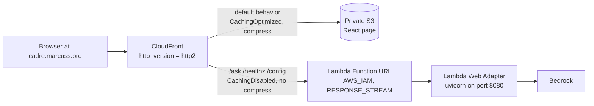

# Architecture — one distribution, two origins, one hostname

`cadre` streams a chat answer from a Lambda-backed FastAPI app to a browser
through exactly one CloudFront distribution, so `fetch("/ask")` is same-origin
with the page that issued it — no CORS preflight sits in front of the SSE
connection. The shape is recorded in `adr/0001-streaming-chatbot-cloudfront-lambda-s3.md`,
which the repo's `CLAUDE.md` calls load-bearing: don't fight it without a
superseding ADR.

*Caption: the request path — CloudFront routes everything not matched by the API
behaviors to S3, and the three API paths to the Lambda Function URL.*

## Why there is no API Gateway

Streaming is the whole point, and the natural path buffers. API Gateway HTTP
APIs buffer the full response before returning it; so does any non-zero-TTL
CloudFront cache policy; so does response compression. Each one silently turns
"streaming" into "a long pause, then everything at once" — no error anywhere in
the chain. The Lambda origin is a Function URL with `invoke_mode =
"RESPONSE_STREAM"` (`infra/lambda.tf`), and the container runs the AWS Lambda
Web Adapter extension (`public.ecr.aws/awsguru/aws-lambda-adapter:0.9.1`,
`AWS_LWA_INVOKE_MODE=response_stream` in `backend/Dockerfile`). The adapter
turns a Lambda invoke into ordinary HTTP against uvicorn on `:8080`, so the same
image runs unchanged under `docker run` and in Lambda.

## The streaming path

The browser POSTs to `/ask` with `x-amz-content-sha256`; CloudFront SigV4-signs
the request through the Lambda-typed OAC; the Lambda streams the
[SSE contract](/openwiki/domain/sse-contract.md) back through the same pipe.
One OAC cannot front both origin types, so there are two
(`…origin_access_control.lambda` and `.s3` in `infra/cloudfront.tf`).

### Four settings that each silently break streaming

Mirrored in `infra/README.md` ("Things that will silently break streaming") —
keep both in sync:

| Setting | Why it matters |
|---|---|
| `cache_policy_id = Managed-CachingDisabled` on the API behaviors | Any non-zero TTL makes CloudFront buffer the response to store it. |
| `compress = false` on the API behaviors | Compression buffers the body to compress it. |
| `http_version = "http2"` on the distribution | HTTP/3 (QUIC) severs long SSE mid-response (`ERR_QUIC_PROTOCOL_ERROR`); `curl` ignores `alt-svc`, so it passes a curl smoke test and breaks every real visitor. |
| `origin_read_timeout` / `origin_keepalive_timeout` on the Lambda origin | Must be ≥ `var.lambda_timeout_s`, else CloudFront 504s mid-stream. Both are 60s — CloudFront's cap without a quota increase — so the Lambda timeout is capped to match. |

This is also the reason the [operations runbooks](/openwiki/operations/runbooks.md)
insist on verifying in a browser, not just curl.

### Auth: `AWS_IAM` Function URL + OAC, never `NONE`

`authorization_type = "AWS_IAM"` because the org data perimeter 403s
`NONE`-auth Function URLs. The API behaviors use `Managed-AllViewerExceptHostHeader`
— the `Host` header must stay the Function URL's own hostname or the signature
won't verify. **Two grants are required, not one** (`infra/lambda.tf`, both
scoped to the distribution ARN):

- `aws_lambda_permission.cloudfront` — `lambda:InvokeFunctionUrl`
- `aws_lambda_permission.cloudfront_invoke` — `lambda:InvokeFunction`, which
  Function URLs created since October 2025 additionally require; without it
  every signed request 403s with the same generic body as a bad signature. This
  was the root cause of the 403 that held the stack up.

The viewer must also hash every POST body (`x-amz-content-sha256`) — the OAC
signature covers the viewer-supplied payload hash; GET is exempt. The client
side of that is documented with the [SSE contract](/openwiki/domain/sse-contract.md).

## Zero secrets by design

There is no static credential anywhere, which is why the repository can be
public:

| Hop | How it authenticates |
|---|---|
| Lambda → Bedrock | SigV4 from the execution role (`aws_iam_role_policy.bedrock`) |
| GitHub Actions → AWS | OIDC only, two separate roles |
| CloudFront → Lambda URL | Lambda-typed OAC, SigV4-signed |
| CloudFront → S3 | S3-typed OAC; the bucket blocks all public access |

`terraform.tfvars` and `backend.hcl` are gitignored as noise, not secrets. The
first real secret (likely a Langfuse key) has a pre-agreed pattern: SSM
`SecureString` seeded `SET_OUT_OF_BAND` with `lifecycle { ignore_changes =
[value] }`, written out of band, read at container start.

## What ADR 0001 records

The ADR captures nine decisions: (1) one distribution/two origins, (2)
RESPONSE_STREAM + Lambda Web Adapter instead of API Gateway, (3) `AWS_IAM`
Function URL + the two-permission trap, (4) zero secrets, (5) OIDC-only CI with
two split roles, (6) two-phase custom domain via Cloudflare, (7) Terraform in CI
with plan-artifact apply, (8) immutable ECR tags and deploy-by-SHA with
rollback, and (9) `ENTRYPOINT []` so the base image's entrypoint can't swallow
the uvicorn command. Each maps to source: `infra/{cloudfront,lambda}.tf`,
`infra/{oidc,ci_terraform,acm,variables}.tf`,
`.github/workflows/{terraform,deploy,ci}.yml`, and `backend/Dockerfile`.

### Tradeoffs that still shape the system

- The 60s cap on every brain turn: the Lambda timeout is pinned to CloudFront's
  origin-timeout cap; buying more time needs an AWS quota increase first.
- Streaming is guarded by docs, not tests — the four breakers produce no error
  and no failing CI check.
- `cadre-terraform`'s `ManagedServices` is service-wildcarded; the real boundary
  is the `production` approval gate (a process control).
- Nothing in CI boots the container before production; the post-deploy
  `/healthz` smoke is the first boot.

## Related concepts

- [SSE contract and rails](/openwiki/domain/sse-contract.md) — the wire format
  that streams over this path.
- [Terraform infrastructure](/openwiki/infrastructure/terraform.md) — the
  configuration that provisions this stack.
- [CI/CD and deployment](/openwiki/workflows/ci-cd.md) — the workflows that
  ship it and the OIDC roles that authorize them.
- [Operations runbooks](/openwiki/operations/runbooks.md) — bootstrap, custom
  domain attach, and 403 bisection for this stack.
