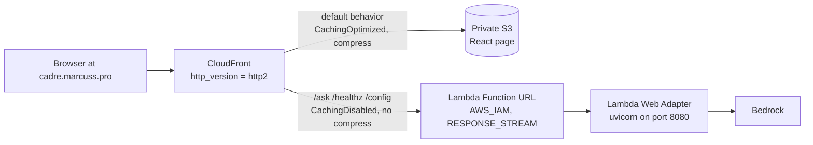

# Architecture — one distribution, two origins, one hostname

Everything is served from one CloudFront distribution, so `fetch("/ask")` is
same-origin with the page — no CORS preflight in front of the SSE connection.
The shape is recorded in `adr/0001-streaming-chatbot-cloudfront-lambda-s3.md`;
don't fight it without a superseding ADR.

## Why there is no API Gateway

API Gateway HTTP APIs, any non-zero-TTL cache policy, and compression each
buffer the full response — streaming silently becomes one blob, no error
anywhere. Instead: a Function URL with `invoke_mode = "RESPONSE_STREAM"`
(`infra/lambda.tf`) plus the Lambda Web Adapter
(`AWS_LWA_INVOKE_MODE=response_stream`, `backend/Dockerfile`), which turns
invokes into plain HTTP against uvicorn on `:8080` — the same image runs
unchanged under `docker run` and in Lambda.

### Four settings that each silently break streaming

Mirrored in `infra/README.md` — keep in sync; verify in a browser, not curl.

| Setting | Why it matters |
|---|---|
| `cache_policy_id = Managed-CachingDisabled` on the API behaviors | Any non-zero TTL makes CloudFront buffer the response to store it. |
| `compress = false` on the API behaviors | Compression buffers the body to compress it. |
| `http_version = "http2"` on the distribution | HTTP/3 (QUIC) severs long SSE mid-response; `curl` ignores `alt-svc`, so it passes a curl smoke test and breaks every real visitor. |
| `origin_read_timeout` / `origin_keepalive_timeout` on the Lambda origin | Must be ≥ `var.lambda_timeout_s`, else CloudFront 504s mid-stream. Both are 60s — CloudFront's cap without a quota increase — so the Lambda timeout is capped to match. |

### Auth: `AWS_IAM` Function URL + OAC, never `NONE`

- `authorization_type = "AWS_IAM"` — the org data perimeter 403s `NONE`-auth
  Function URLs. CloudFront signs via a Lambda-typed OAC; one OAC cannot front
  both origin types, so there are two (`infra/cloudfront.tf`).
- **Two grants required, not one** (`infra/lambda.tf`, both scoped to the
  distribution ARN): `lambda:InvokeFunctionUrl` *and* `lambda:InvokeFunction`
  (needed by Function URLs created since October 2025). Missing either 403s
  with the same generic body as a bad signature — the root cause of the 403
  that held the stack up.
- Every POST must carry `x-amz-content-sha256` — the OAC signature covers the
  viewer-supplied payload hash; GET is exempt. Client side:
  [SSE contract](/openwiki/domain/sse-contract.md).
- API behaviors use `Managed-AllViewerExceptHostHeader` — the `Host` header
  must stay the Function URL's own hostname or the signature won't verify.

## Zero secrets by design

There is no static credential anywhere, which is why the repository can be
public:

| Hop | How it authenticates |
|---|---|
| Lambda → Bedrock | SigV4 from the execution role (`aws_iam_role_policy.bedrock`) |
| GitHub Actions → AWS | OIDC only, two separate roles |
| CloudFront → Lambda URL | Lambda-typed OAC, SigV4-signed |
| CloudFront → S3 | S3-typed OAC; the bucket blocks all public access |

`terraform.tfvars`/`backend.hcl` are gitignored as noise, not secrets. First
real secret: SSM `SecureString` seeded `SET_OUT_OF_BAND` with
`ignore_changes = [value]`, written out of band, read at container start.

## ADR 0001 and open tradeoffs

ADR 0001's nine decisions map to `infra/*.tf`,
`.github/workflows/{terraform,deploy,ci}.yml`, and `backend/Dockerfile`
(`ENTRYPOINT []` so the base image can't swallow the uvicorn command). Still
open:

- Every brain turn is capped at 60s (CloudFront's origin-timeout cap; quota
  increase to raise).
- Streaming is guarded by docs, not tests — the four breakers fail no CI check.
- `cadre-terraform`'s `ManagedServices` is wildcarded; the real boundary is the
  `production` approval gate.
- Nothing in CI boots the container — the post-deploy `/healthz` smoke is the
  first boot.
