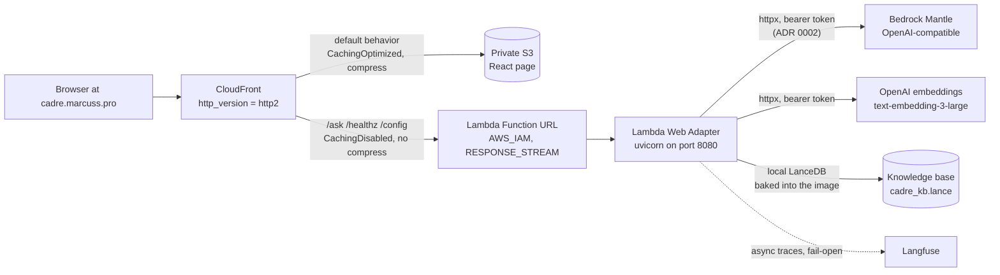

# Architecture — one distribution, two origins, one hostname

Everything is served from one CloudFront distribution, so `fetch("/ask")` is
same-origin with the page — no CORS preflight in front of the SSE connection.
The shape is recorded in `adr/0001-streaming-chatbot-cloudfront-lambda-s3.md`;
don't fight it without a superseding ADR — and note `adr/0002` now supersedes
ADR 0001's Bedrock-authentication statements.

## Why there is no API Gateway

API Gateway HTTP APIs, any non-zero-TTL cache policy, and compression each
buffer the full response — streaming silently becomes one blob, no error
anywhere. Instead: a Function URL with `invoke_mode = "RESPONSE_STREAM"`
(`infra/lambda.tf`) plus the Lambda Web Adapter
(`AWS_LWA_INVOKE_MODE=response_stream`, `backend/Dockerfile`), which turns
invokes into plain HTTP against uvicorn on `:8080` — the same image runs
unchanged under `docker run` and in Lambda.

### Four settings that each silently break streaming

Mirrored in `infra/README.md` — keep in sync; verify in a browser, not curl.

| Setting | Why it matters |
|---|---|
| `cache_policy_id = Managed-CachingDisabled` on the API behaviors | Any non-zero TTL makes CloudFront buffer the response to store it. |
| `compress = false` on the API behaviors | Compression buffers the body to compress it. |
| `http_version = "http2"` on the distribution | HTTP/3 (QUIC) severs long SSE mid-response; `curl` ignores `alt-svc`, so it passes a curl smoke test and breaks every real visitor. |
| `origin_read_timeout` / `origin_keepalive_timeout` on the Lambda origin | Must be ≥ `var.lambda_timeout_s`, else CloudFront 504s mid-stream. Both are 60s — CloudFront's cap without a quota increase — so the Lambda timeout is capped to match. |

### Auth: `AWS_IAM` Function URL + OAC, never `NONE`

- `authorization_type = "AWS_IAM"` — the org data perimeter 403s `NONE`-auth
  Function URLs. CloudFront signs via a Lambda-typed OAC; one OAC cannot front
  both origin types, so there are two (`infra/cloudfront.tf`).
- **Two grants required, not one** (`infra/lambda.tf`, both scoped to the
  distribution ARN): `lambda:InvokeFunctionUrl` *and* `lambda:InvokeFunction`
  (needed by Function URLs created since October 2025). Missing either 403s
  with the same generic body as a bad signature — the root cause of the 403
  that held the stack up.
- Every POST must carry `x-amz-content-sha256` — the OAC signature covers the
  viewer-supplied payload hash; GET is exempt. Client side:
  [SSE contract](/openwiki/domain/sse-contract.md).
- API behaviors use `Managed-AllViewerExceptHostHeader` — the `Host` header
  must stay the Function URL's own hostname or the signature won't verify.

## Secrets, held in SSM

The repository holds no credential — it can be public — but ADR 0002
deliberately ended the "zero secrets" claim, and Phase 2/3 grew the count: the
model path needs a Bedrock key, retrieval needs an OpenAI embeddings key, and
tracing needs the Langfuse trio. All five parameters are `data`-referenced
out-of-band SSM values Terraform reads, never creates (ADR 0002's precedent,
repeated in `infra/openai.tf` and `infra/langfuse.tf`).

| Hop | How it authenticates |
|---|---|
| Lambda → Bedrock | Bearer token over HTTPS to the Mantle endpoint (`app/llm.py`); key read at call time from the `AWS_BEARER_TOKEN_BEDROCK` env var, which Terraform pulls from the SSM `SecureString` `/cadre/bedrock-api-key` — created out of band, never committed (ADR 0002). The old `bedrock:InvokeModel` SigV4 grant is deleted. |
| Lambda → OpenAI embeddings | `OPENAI_API_KEY` env var (from SSM `/cadre/openai-api-key`), resolved per request like the Bedrock key (`app/embeddings.py`); a missing key becomes `retrieve: skipped`, never a crash. |
| Lambda → Langfuse | `LANGFUSE_PUBLIC_KEY`/`LANGFUSE_SECRET_KEY`/`LANGFUSE_HOST` from the three SSM params (`infra/langfuse.tf`); credentials read **once at import**, probed at container start, and everything fails open — a Langfuse outage costs the trace, never the turn (`app/tracing.py`). |
| GitHub Actions → AWS | OIDC only, two separate roles; `cadre-terraform` reads all five params at plan time, `cadre-deploy` only the Bedrock key (`assert_models` needs it pre-build) |
| CloudFront → Lambda URL | Lambda-typed OAC, SigV4-signed |
| CloudFront → S3 | S3-typed OAC; the bucket blocks all public access |

Every decrypted `data` read lands in Terraform state, so the state bucket is as
sensitive as the keys. `terraform.tfvars`/`backend.hcl` are gitignored as
noise, not secrets. Rotation is an operational task: write the SSM value, then
re-apply so the next deploy injects it — Bedrock/OpenAI keys are read per
request (no cold start), Langfuse credentials are read at import, so they also
need a container restart.

## ADR 0001, ADR 0002, and open tradeoffs

ADR 0001's nine decisions map to `infra/*.tf`,
`.github/workflows/{terraform,deploy,ci}.yml`, and `backend/Dockerfile`
(`ENTRYPOINT []` so the base image can't swallow the uvicorn command); ADR 0002
supersedes its Bedrock-auth statements. Still open:

- A whole turn — four judge calls, the retrieval condense + embedding calls,
  *and* the brain's generation — must fit inside 60s (CloudFront's
  origin-timeout cap; quota increase to raise). Token and timeout budgets in
  `backend/app/config.py` enforce it (`RETRIEVE_TIMEOUT_S` bounds the whole
  retrieve node); `: ping` heartbeats do not extend the cap (KB-004). The KB's
  one-off open cost is paid at container init, off every turn's budget
  ([knowledge base](/openwiki/domain/knowledge-base.md)).
- Retrieval and tracing fail open like the guards (KB-009): a mismatched KB or
  a Langfuse outage answers and streams fine — visible only as a missing
  `trace` frame or a `skipped`/`kb_*` detail. Nothing on the wire looks broken,
  which is why the e2e gates `CADRE_E2E_KB` / `CADRE_E2E_LANGFUSE`
  ([CI/CD](/openwiki/workflows/ci-cd.md)) exist.
- The four streaming-breakers still fail no push-gated check. The manual e2e
  dispatch ([CI/CD](/openwiki/workflows/ci-cd.md)) asserts no `Content-Length`
  and real incremental tokens (KB-010, KB-007), but nothing on push boots or
  streams against the real stack.
- `cadre-terraform`'s `ManagedServices` is wildcarded; the real boundary is the
  `production` approval gate.
- Model misconfiguration ships as a *working* chat with amber rails, because
  every guard fails open (KB-009) — the pre-deploy `assert_models` check is
  what stops a wrong id from ever reaching an image.
