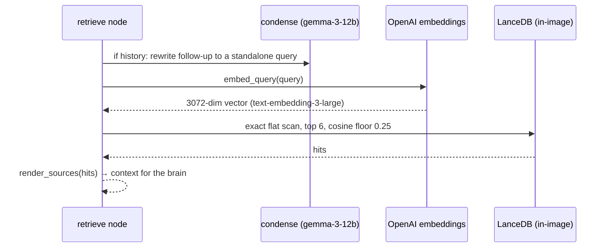

# Knowledge base and retrieval

Since Phase 3 (issue #62) the `retrieve` step grounds answers in a vector
corpus: 55 allowlisted `www.cadreai.com` pages chunked into 131 entries, built
**offline** by `backend/ingest/` and committed into the image as
`backend/app/kb/cadre_kb.lance` (LanceDB table `chunks`) plus
`manifest.json` — never built or refreshed at runtime, and `app/` may never
import `ingest/` (test_ingest_isolation). Full pipeline detail lives in
`backend/ingest/README.md`.

## The retrieve step

A first message is already standalone and skips condensing. The condenser
(`CADRE_MODEL_CONDENSE`, gemma-3-12b) fails open to the visitor's own words —
a worse query, never a broken turn. Hits above `RETRIEVE_MIN_SCORE` (0.25)
become `context` that the brain is prompted to cite (`prompts/context.txt`);
no context means the [persona baseline](/openwiki/domain/sse-contract.md)
answer, byte-identical to pre-Phase 3.

## Fail-open, named on the wire

Every failure ends as `retrieve` `skipped` with a machine-readable detail
(wire values shared with [SSE contract](/openwiki/domain/sse-contract.md)):
`kb_unavailable` (unexpected error), `kb_disabled` (kill switch / no artifact),
`kb_dimension_mismatch` (manifest vs config), `kb_timeout` (past 6s). Zero hits
is a `pass` with `no_hits` — an empty corpus and a broken one must not look the
same. `kb_not_wired` was retired with the stub.

## Footguns

- **Embedding width is load-bearing.** `text-embedding-3-large` at native 3072
  dims, `dimensions` shortening unused. A mismatch does not raise at query
  time — it returns confident wrong neighbours — so `store.ensure_ready()`
  compares manifest **and table width** against
  [config](/openwiki/infrastructure/terraform.md) and disables the KB instead
  of searching. Re-ingesting at a new width is a reviewed commit that must move
  `config.py` and the artifact together.
- **Warm-up is init's job (issue #67).** The one-off open (import lancedb,
  connect, open table, read schema) used to run on the first visitor's turn —
  9661 ms cold vs 548 ms warm. The [container init](/openwiki/architecture/overview.md)
  lifespan now calls `kb.available()` inside Lambda's full-CPU-burst window, so
  the cost is off every turn's budget (KB-004); an unavailable KB logs and
  answers from the baseline.
- **Citations must linkify (KB-017).** The web regex needed `(` `[` `]`
  excluded so a markdown `[url](url)` answer tail is not swallowed; `/articles`
  and `/case-studies` index paths label "see article", `/contact` "contact us".

## Ingest pipeline

| File | Role |
|---|---|
| `allowlist.py` | the 55 URLs, frozen |
| `fetch.py` | polite, single-threaded fetch |
| `extract.py` | HTML → (heading, paragraph) pairs |
| `boilerplate.py` | drops blocks present on ≥80% of the corpus (site chrome; removed 45 menu blocks that were polluting top hits) |
| `chunk.py` | ~800-token chunks, ~100-token overlap |
| `embed.py` / `build_kb.py` | embed (L2-normalized, no ANN index — a flat scan is exact and ms-fast) and write the artifact |

Rebuild is manual by design — the corpus changes a few times a year and a KB
that rebuilds itself is a KB nobody reviewed:
`pip install -r requirements-ingest.txt`, `python -m ingest.build_kb --dry-run`
(free), then the real run with `OPENAI_API_KEY` (from SSM `/cadre/openai-api-key`,
never a file), then `git add app/kb` — see
[operations runbooks](/openwiki/operations/runbooks.md). The e2e
grounded-answer suite ([CI/CD](/openwiki/workflows/ci-cd.md)) proves retrieval
works on a real target.
