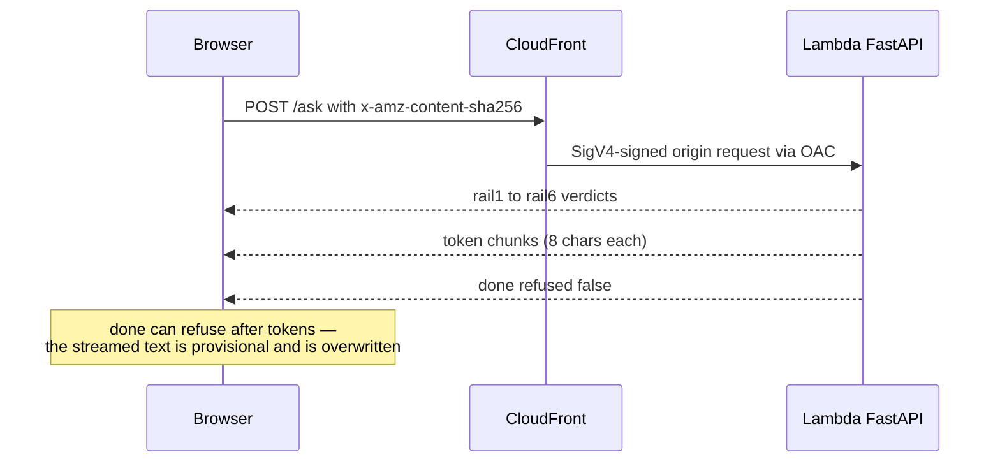

# SSE contract and rails

The wire format is defined in `backend/app/sse.py` and mirrored verbatim in
`web/src/types.ts`. Nothing imports across the language boundary, so renaming a
field is a silent breaking change — change both sides in one PR, or neither.
It streams over the [architecture's path](/openwiki/architecture/overview.md).

## The four events

Every frame is `event: <name>` + `data: <json>`:

| Event | Payload | Meaning |
|---|---|---|
| `rail` | `rail_id`, `rail_name`, `passed`, `latency_ms`, `reason`, `degraded` | One rail verdict; six are emitted per turn. |
| `token` | `text` | One chunk of the answer; the client appends chunks. |
| `done` | `refused`, `refusal_reason`, `latency_ms` | Terminal event — always the last frame of a normal stream. |
| `error` | `message` | Mid-stream failure after the HTTP 200 was already committed. |

Ordering is fixed: six `rail` events (they paint the trace panel), then `token`
chunks, then `done`. The backend yields `await asyncio.sleep(0)` per frame so
events flush separately, and streams replies in 8-char chunks so a broken
incremental-render path can't hide. Validation failures are **not** HTTP
errors: a malformed body gets a failed `rail1` plus `done {refused: true}` —
still HTTP 200, so the browser uses its normal `done` path, not its offline
branch.

## The six rails

`backend/app/sse.py` (`RAILS`) and `web/src/types.ts` (`RAIL_SPECS`) must agree:

| # | id | name | Role |
|---|---|---|---|
| 1 | `rail1` | `input_validation` | Message shape: non-empty, ≤ 2000 chars, no control chars (also validated by Pydantic in `main.py`) |
| 2 | `rail2` | `injection` | Prompt-injection screen |
| 3 | `rail3` | `topic` | On-topic judge |
| 4 | `rail4` | `brain` | The answer itself (the `_reply_for()` seam) |
| 5 | `rail5` | `output_guard` | Output-side guard on the complete reply |
| 6 | `rail6` | `scrub` | Final redaction pass |

## Client rail-status semantics

The wire only sends verdicts; `web/src/lib/useCadreChat.ts` infers the rest:

- **pending** — all six up front, so a stream that dies mid-turn shows *which*
  rail never reported.
- **passed / blocked** — from `passed`; the first failing non-degraded rail is
  the blocker; later unreported rails become **skipped** at `done`.
- **degraded** — model call failed, fail-open pass; amber, never green (an
  outage that reads as success is worse than a visible one); not the blocker.
- **lost** — still pending when the stream died without `done`; amber, not red
  — the outcome is genuinely unknown.

`done {refused: true}` can arrive *after* tokens: the refusal overwrites the
screen because streamed text is provisional.

## Backend and client

- `backend/app/main.py` is a walking skeleton: `_reply_for()` is the entire
  brain (a stub) and the seam for wiring in Bedrock. `GET /healthz` is the
  deploy smoke probe; `GET /config` serves greeting + chips server-side so they
  can't drift. CORS narrows to `CADRE_ALLOWED_ORIGIN` when `CADRE_ENV=prod`;
  `docs_url`/`redoc_url` are off.
- `EventSource` only issues GETs and can't set headers, so `web/src/lib/sse.ts`
  hand-rolls a fetch reader: `TextDecoder {stream: true}` (multi-byte chars
  split across chunks), buffer drained at `\n\n` boundaries, heartbeats
  dropped, trailing frame still yielded. Don't "simplify" back to
  `EventSource`.
- Every `/ask` POST carries `x-amz-content-sha256` (`sha256Hex`) — without it
  every POST 403s.
- Keep the composer's 2000-char cap equal to the backend's `MAX_INPUT_LEN`.

## Tests that pin the contract

- `backend/tests/test_ask.py` — rail order, chunked emission, refusal shape,
  every `/config` suggestion answers.
- `web/src/lib/sse.test.ts` — `parseFrame`/`readSse` edge cases, `sha256Hex`.
- `web/src/types.test.ts` — rail presentation, `formatLatency`, `freshRails()`.

Run with `pytest` (backend/) and `npm test` (web/);
[CI](/openwiki/workflows/ci-cd.md) runs all on every push and PR.
