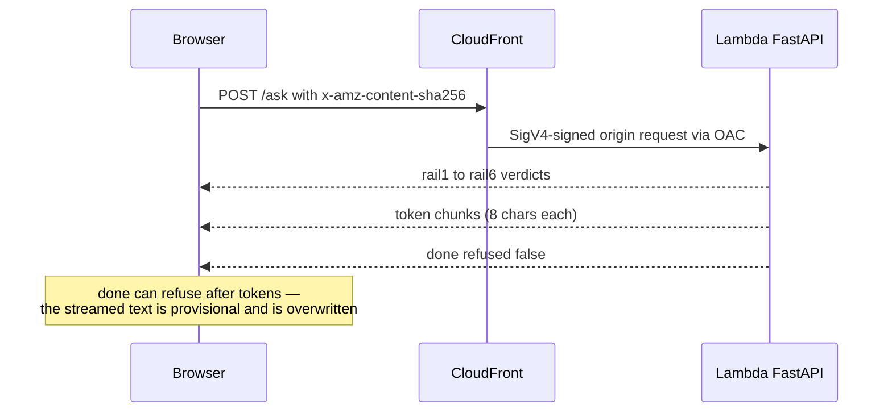

# SSE contract and rails

The wire format is defined once in `backend/app/sse.py` and mirrored verbatim
in `web/src/types.ts`. Nothing imports across the language boundary, so renaming
a field is a silent breaking change — the two files are kept verbatim-matched on
purpose, and both sides must change in one PR. The contract streams over the
[architecture's streaming path](/openwiki/architecture/overview.md).

## The four events

Every frame is `event: <name>` + `data: <json>`:

| Event | Payload | Meaning |
|---|---|---|
| `rail` | `rail_id`, `rail_name`, `passed`, `latency_ms`, `reason`, `degraded` | One rail verdict; six are emitted per turn. |
| `token` | `text` | One chunk of the answer; the client appends chunks. |
| `done` | `refused`, `refusal_reason`, `latency_ms` | Terminal event — always the last frame of a normal stream. |
| `error` | `message` | Mid-stream failure after the HTTP 200 was already committed. |

Ordering is fixed: all six `rail` events first (the client paints the trace
panel from them — tokens-first would leave the panel blank when the answer
appears), then `token` chunks, then `done`. The backend yields
`await asyncio.sleep(0)` after each frame so events flush as separate chunks
rather than coalescing into one write. Replies stream in 8-char chunks
(`CHUNK_SIZE`) so a broken incremental-render path can't hide.

Validation failures are **not** HTTP errors: a malformed body produces a single
`rail` event (`rail1`/`input_validation`, `passed: false`, reason from the
rejection code) followed by `done {refused: true, refusal_reason:
"rail1:…"}` — still HTTP 200, so the browser renders it through its normal
`done` path instead of its offline branch.

*Caption: one /ask turn. The refusal-after-tokens path (output guard sees only
the complete reply) is supported by the contract and the client even though the
current skeleton never exercises it with tokens.*

## The six rails

`backend/app/sse.py` (`RAILS`) and `web/src/types.ts` (`RAIL_SPECS`) must agree:

| # | id | name | Role |
|---|---|---|---|
| 1 | `rail1` | `input_validation` | Message shape: non-empty, ≤ 2000 chars, no control chars (also validated by Pydantic in `main.py`) |
| 2 | `rail2` | `injection` | Prompt-injection screen |
| 3 | `rail3` | `topic` | On-topic judge |
| 4 | `rail4` | `brain` | The answer itself (the `_reply_for()` seam) |
| 5 | `rail5` | `output_guard` | Output-side guard on the complete reply |
| 6 | `rail6` | `scrub` | Final redaction pass |

## Client rail-status semantics

The wire only ever sends `rail` verdicts; the client infers four of the six
display states in `web/src/lib/useCadreChat.ts`:

- **pending** — rendered for all six up front, so a stream that dies mid-turn
  shows *which* rail never reported instead of spinning forever.
- **passed / blocked** — from `passed`; the first failing (and not degraded)
  rail becomes the blocker, and rails after it that never reported are marked
  **skipped** at `done`.
- **degraded** — a rail whose model call failed and returned a fail-open pass.
  It renders **amber, never green** ("an outage that reads as success is worse
  than a visible outage") and is *not* the blocker — the turn continues.
- **lost** — still pending when the stream died without `done`; amber, not red,
  because the outcome is genuinely unknown.

`done {refused: true}` can arrive *after* tokens streamed: the refusal text
overwrites whatever is on screen because the streamed text was provisional.

## The walking-skeleton backend

`backend/app/main.py` is deliberately minimal: `_reply_for()` is the entire
brain for now (returns `"pong"` for `ping`, a stub otherwise) and is the
documented seam — wiring in Bedrock means replacing that one function. What is
implemented in full is the SSE contract, `GET /healthz` (liveness probe used by
the deploy smoke test), and `GET /config` (greeting + suggestion chips live
server-side so they can't drift from what the backend actually answers). CORS is
narrowed to `CADRE_ALLOWED_ORIGIN` alone when `CADRE_ENV=prod`; the localhost
origins are dev-only. `docs_url`/`redoc_url` are disabled — no public,
unauthenticated API docs behind CloudFront.

## The client transport

`EventSource` is unusable — it only issues GETs and cannot set headers — so
`web/src/lib/sse.ts` hand-rolls a fetch-based reader: a `TextDecoder` with
`{stream: true}` (a multi-byte char split across chunks must not become a
replacement character), buffering drained only at `\n\n` boundaries (a chunk
boundary can land mid-frame), comment-only heartbeat frames dropped, and a
trailing frame without a blank line still yielded. Every `/ask` POST carries
`x-amz-content-sha256` (hex SHA-256 of the body via `sha256Hex`) — CloudFront's
OAC signs over the viewer-supplied hash, and Lambda rejects unsigned payloads
with 403 "signature does not match".

## Tests that pin the contract

- `backend/tests/test_ask.py` — drives the real ASGI app: rail order,
  rails-before-tokens, chunked emission, cache headers, the refusal shape, and
  that every `/config` suggestion actually answers.
- `web/src/lib/sse.test.ts` — `parseFrame`/`readSse` edge cases (frames split
  across chunks, multi-byte characters, heartbeats) and `sha256Hex` constants.
- `web/src/types.test.ts` — rail presentation (degraded icon ≠ passed icon),
  `formatLatency`, `freshRails()` returning a fresh array per turn.

Run them with `pytest` from `backend/` and `npm test` / `npm run typecheck` in
`web/`; the [CI workflows](/openwiki/workflows/ci-cd.md) run all of them on
every push and PR.

## Changing this area

- Change both sides of the contract (backend `sse.py` and web `types.ts`) in
  one PR, or neither.
- Keep the web composer's 2000-char cap equal to the backend's `MAX_INPUT_LEN`.
- The reader in `sse.ts` must stay — don't "simplify" back to `EventSource`.
- Never drop `x-amz-content-sha256` from the POST; every POST 403s without it.
