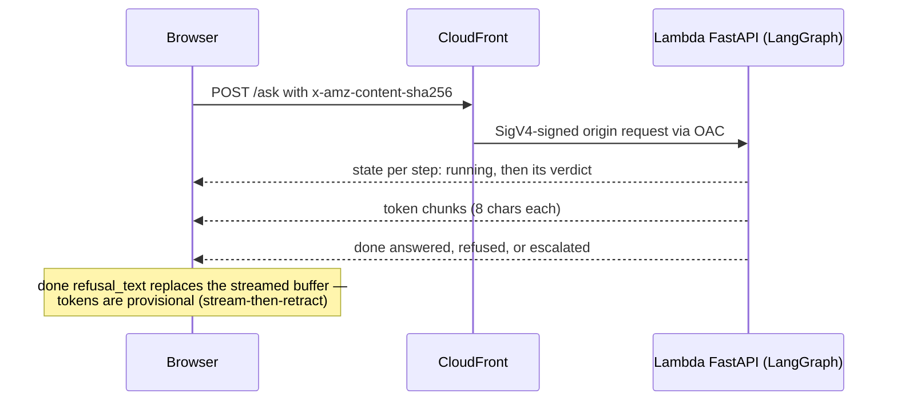

# SSE contract v2

The wire format is defined in `backend/app/sse.py` and mirrored verbatim in
`web/src/types.ts`. Nothing imports across the language boundary, so renaming a
field compiles green on both sides and breaks silently in a browser (KB-005) —
change both sides in one PR, or neither. It streams over the
[architecture's path](/openwiki/architecture/overview.md).

## The events

Every frame is `event: <name>` + `data: <json>`; `: ping` comment frames (no
data) keep intermediaries from reaping a connection that is merely waiting on a
slow step, and the client drops them.

| Event | Payload | Meaning |
|---|---|---|
| `trace` | `trace_id`, `url` | The public Langfuse trace link — at most once, the first frame of the turn; absent entirely when tracing is down (fail-open). |
| `state` | `step`, `status` (`running`/`pass`/`fail`/`skipped`), `detail?`, `elapsed_ms?` | One pipeline transition; each of the six steps emits `running` then its verdict. `elapsed_ms` is an int on `pass`/`fail`, `null` otherwise. |
| `token` | `text` | A fragment of the answer, only while `brain` (or the escalation text) streams. |
| `done` | `outcome` (`answered`/`refused`/`escalated`/`error`), `refusal_text?` | Always the terminal event of a normal stream. |
| `error` | `message` | Terminal on its own — no `done` follows. Generic on the wire, detailed in the log. |

`state` events are written *before* the step works (wire first, then state), so
the stepper is live rather than a replay printed at the end. Malformed bodies
are **not** HTTP errors: a body the graph cannot be handed gets
`validate_input` fail + `skipped` for the rest + `done {refused}` — still HTTP
200, so the browser uses its normal `done` path, not an offline branch.

## The six steps

`backend/app/sse.py` (`STEPS`) and `web/src/types.ts` (`STEPS`/`STEP_LABELS`)
must agree:

| # | id | Role |
|---|---|---|
| 1 | `validate_input` | Deterministic checks (empty, >2000 chars, control chars, client-id format, rate limit) then an SLM validity judge |
| 2 | `injection_check` | Prompt-injection classifier |
| 3 | `topic_classifier` | Three-way route: in-scope → `retrieve`; off-topic → refuse; `needs_human` → escalate |
| 4 | `retrieve` | KB lookup — not wired yet; reports `skipped` with `kb_not_wired` (plan.md Phase 3) |
| 5 | `brain` | The answer; streams tokens, and is the one step with no fail-open path — a failure propagates to a terminal `error` |
| 6 | `output_safety` | Guard on the complete streamed answer; fail → stream-then-retract refusal |

## Status and outcome semantics

- **`pass` with `detail: "degraded"`** — the verdict came from the fail-open
  policy (model errored or returned no verdict), not a real classification;
  rendered amber, never green (KB-009). v2 keys this off `detail`, not a wire
  status of its own.
- **`skipped` is server-authoritative** — `sse.unreported()` emits it for every
  step that never ran before a terminal refusal/escalation, so the client never
  infers anything from silence.
- **Client-only statuses** (`web/src/types.ts`): `pending` (painted up front),
  `lost` (still pending when the stream died without `done` — genuinely unknown).
- `done {refused}` can arrive *after* tokens: `refusal_text` overwrites the
  screen. `escalated` streams the booking text as tokens and keeps `status:
  done` with `outcome` so the UI renders it distinctly.

## Backend and client

- `backend/app/main.py` compiles the LangGraph `StateGraph` once at import;
  `/ask` runs it as a task and drains an `asyncio.Queue`. Nodes emit through
  `QueueEmitter`, which rides LangGraph `config["configurable"]` — never the
  checkpointable state channel (KB-008) — so the SSE stream is a projection of
  the graph's progress.
- Model steps are in `app/graph/models.py`; the transport is `app/llm.py`:
  plain httpx against Bedrock's Mantle endpoint with a bearer key (ADR 0002),
  bounded retry on 5xx only, and never a retry after the first token delta.
- In-process rate limiter (`app/ratelimit.py`): 30 turns / 60s per instance;
  a refusal arrives as `validate_input` fail with `rate_limited`.
- `web/src/lib/sse.ts` hand-rolls a fetch reader (`TextDecoder {stream: true}`
  for multi-byte chars, buffer drained at `\n\n`, comment frames dropped) —
  `EventSource` only issues GETs and can't set headers. Don't "simplify" back.
- Every `/ask` POST carries `x-amz-content-sha256` (`sha256Hex`) or it 403s
  (KB-002). Keep the composer's 2000-char cap equal to `config.MAX_INPUT_LEN`;
  greeting/chips come from `/config` so they can't drift.

## Tests that pin the contract

- `backend/tests/test_ask.py` — the malformed-body wire sequence, refusal
  shapes; `test_graph.py` — routing (fail → refuse, needs_human → escalate);
  `test_models.py` — verdict parsing incl. `_label`'s space/hyphen tolerance;
  `test_llm.py` — transport, retry, no-retry-after-first-delta; plus
  `test_ratelimit.py`, `test_persona.py`, `test_assert_models.py`.
- `web/src/lib/sse.test.ts` — `parseFrame`/`readSse`/`sha256Hex`;
  `web/src/lib/turnReducer.test.ts` — step transitions;
  `web/src/types.test.ts` — statuses, `freshSteps()`.
- `backend/tests/e2e/` — real-target suite behind the `e2e` marker and the
  `CADRE_E2E_BEDROCK` gate ([CI/CD](/openwiki/workflows/ci-cd.md)); asserts no
  `Content-Length` (KB-010) and real incremental tokens.

Run with `pytest` (backend/) and `npm test` (web/);
[CI](/openwiki/workflows/ci-cd.md) runs the unit suites on every push and PR.
