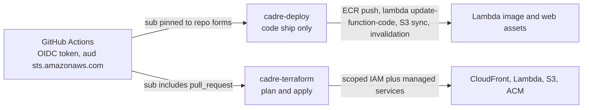

# Terraform infrastructure

`infra/` is a flat root module — no `main.tf`, one file per concern
(`lambda.tf`, `cloudfront.tf`, `oidc.tf`, `ci_terraform.tf`, `acm.tf`,
`variables.tf`, `outputs.tf`, `versions.tf`). It provisions the
[streaming stack documented in the architecture](/openwiki/architecture/overview.md).
`infra/README.md` is the living operational doc; `infra/CLAUDE.md` carries the
editing rules. The Terraform state lives in S3 with native locking
(`use_lockfile = true`, no DynamoDB table, `required_version >= 1.10`), and the
`aws` provider is `~> 6.0`.

## Resource families

| Family | Files | Role |
|---|---|---|
| ECR repo + lifecycle policy | `lambda.tf` | `image_tag_mutability = "IMMUTABLE"`, keep 10 most recent images |
| Lambda function + Function URL | `lambda.tf` | arm64 image package, `RESPONSE_STREAM` invoke mode, `AWS_IAM` auth, env vars below, `lifecycle { ignore_changes = [image_uri] }` |
| Two Lambda permissions | `lambda.tf` | `lambda:InvokeFunctionUrl` + `lambda:InvokeFunction`, both scoped to the distribution ARN — missing either 403s like a bad signature |
| Execution role + Bedrock policy | `lambda.tf` | SigV4 to Bedrock, scoped to the brain/judge model ARNs and `inference-profile/*`; `AWSLambdaBasicExecutionRole`; CloudWatch log group, 14-day retention |
| Private S3 bucket | `cloudfront.tf` | Versioning, SSE-AES256 + bucket-key, all public access blocked, policy allows only CloudFront `s3:GetObject` |
| Two OACs | `cloudfront.tf` | One per origin type (s3 vs lambda); one OAC cannot front both |
| CloudFront distribution | `cloudfront.tf` | `http_version = "http2"`, `PriceClass_100`, default behavior → S3 (CachingOptimized, compress), ordered behaviors → Lambda URL (CachingDisabled, no compress, AllViewerExceptHostHeader), Lambda-origin timeouts at 60s |
| ACM certificate | `acm.tf` | DNS-validated, deliberately **no** `aws_acm_certificate_validation` (DNS lives in Cloudflare; validation is a human step) |
| `cadre-deploy` IAM role | `oidc.tf` | Code-shipping role (below) |
| `cadre-terraform` IAM role | `ci_terraform.tf` | Plan/apply role (below) |

## The two OIDC roles

Both roles are assumed from GitHub Actions via `sts:AssumeRoleWithWebIdentity`
— there are no static AWS credentials anywhere in the repo. The OIDC provider
itself is an account singleton referenced by ARN
(`var.github_oidc_provider_arn`), never created or imported. Trust conditions
cover **two repo spellings** (name form `Nextasy-Apps-LLC/marcuss-cadre-test`
and the rename-proof id form `…@270195565/…@1324634448`) — every condition is
(2 spellings) × (sub forms).

*Caption: the role split. `cadre-deploy` can ship code but cannot change
configuration or IAM; `cadre-terraform` can plan and apply but is gated by the
production environment approval.*

- **`cadre-deploy`** (`oidc.tf`): ECR push, `lambda:UpdateFunctionCode` +
  function reads, S3 sync, CloudFront invalidation. Deliberately **excludes**
  `lambda:UpdateFunctionConfiguration` — env vars (model ids,
  `CADRE_ALLOWED_ORIGIN`, brain effort) belong to Terraform, so a compromised
  deploy cannot repoint the model or widen the allowed origin. Trust sub includes
  both `ref:refs/heads/main` and `environment:production`, because a job in the
  `production` environment gets a token whose sub claim *replaces* the ref form.
- **`cadre-terraform`** (`ci_terraform.tf`): state-bucket access scoped to
  `${state_key}*`, IAM actions scoped to `role/${project_name}-*`, and
  `ManagedServices` (ecr, lambda, cloudfront, acm, logs, s3) wildcarded on
  purpose — Terraform creates ARNs that don't exist yet. The real boundary is
  the `production` reviewer gate on apply, never the policy width.

## Key variables

| Variable | Default | Note |
|---|---|---|
| `aws_account_id` | — | 12-digit validated |
| `aws_region` | `us-east-1` | required for ACM/CloudFront |
| `project_name` | `cadre` | names ECR/Lambda/IAM/log group |
| `domain_name` | `cadre.marcuss.pro` | |
| `enable_custom_domain` | `true` | two-phase bootstrap flag; `false` for first apply |
| `github_oidc_provider_arn` | — | account singleton, looked up, never created |
| `image_tag` | `bootstrap` | deploy workflow bumps it to the commit SHA |
| `lambda_memory_mb` | `1024` | also scales CPU (TLS per Bedrock call) |
| `lambda_timeout_s` | `60` | capped at CloudFront's 60s origin-timeout |
| `brain_model` / `judge_model` | `anthropic.claude-opus-5` / `anthropic.claude-haiku-4-5` | judge doubles as guard model |
| `brain_effort` | `low` | validated low/medium/high/xhigh/max; main cost lever |
| `state_bucket` / `state_key` | — / `cadre/cadre.tfstate` | must match `backend.hcl` |

## Lambda environment (set by Terraform)

`infra/lambda.tf` injects `CADRE_ENV=prod`, `CADRE_ALLOWED_ORIGIN`,
`CADRE_BRAIN_MODEL`, `CADRE_JUDGE_MODEL`, `CADRE_GUARD_MODEL` (= judge), and
`CADRE_BRAIN_EFFORT`. These are waiting for the real brain — the backend
[walking skeleton](/openwiki/domain/sse-contract.md) only reads
`CADRE_ENV` and `CADRE_ALLOWED_ORIGIN` today. `AWS_LWA_INVOKE_MODE` is *not* set
here; it lives in `backend/Dockerfile` and must stay `response_stream`.

## The streaming-breaker checklist

These four, each on its own, turn streaming back into buffered delivery with no
error — treat them as canon (ADR 0001 + `infra/README.md` both carry them):

1. Non-`CachingDisabled` cache policy on the API behaviors.
2. `compress = true` on an API behavior.
3. `AWS_LWA_INVOKE_MODE` anything other than `response_stream` (Dockerfile, not Terraform).
4. `invoke_mode` on the Function URL other than `RESPONSE_STREAM`, or a Lambda
   origin timeout < `var.lambda_timeout_s`.

## Changing this area

- `terraform fmt -recursive` and `terraform validate` run in CI and hard-fail —
  run them locally first.
- Keep the committed lockfile (it pins provider hashes for linux_amd64 and
  darwin_arm64); never commit a single-platform lockfile.
- Never drop an `ignore_changes` without understanding its out-of-band owner:
  `image_uri` is owned by the deploy workflow, the SSM secret value by the
  out-of-band write.
- `cadre-deploy` must never gain `lambda:UpdateFunctionConfiguration` — env
  vars belong to Terraform.
- The only sanctioned local apply is the bootstrap (the CI role is created *by*
  this Terraform). Everything else applies the reviewed `tfplan` artifact
  through the [terraform workflow](/openwiki/workflows/ci-cd.md).
- First apply, custom-domain attach, and 403 bisection are in the
  [operations runbooks](/openwiki/operations/runbooks.md).
