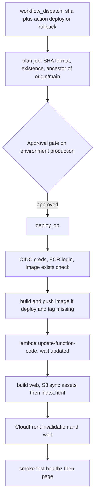

# CI/CD and deployment

Five workflows live in `.github/workflows/`. The OIDC roles they assume are
defined by the [Terraform infrastructure](/openwiki/infrastructure/terraform.md);
what they ship is the [streaming stack](/openwiki/architecture/overview.md).
`docs/ci-cd.md` documents this area for the MkDocs site — note it still says
"four workflows" and doesn't mention `openwiki-update.yml` (tracked in the
[quickstart backlog](/openwiki/quickstart.md)).

| Workflow | Triggers | What it does |
|---|---|---|
| `ci.yml` | PR, push to `main`, dispatch | Web typecheck/test/build, backend pytest, arm64 image build (no push), terraform fmt/validate. Never touches AWS. |
| `deploy.yml` | `workflow_dispatch` only | Deploy or roll back to a chosen SHA, behind the `production` approval gate. |
| `terraform.yml` | PR touching `infra/**`, dispatch | Plan on PR/dispatch; apply on dispatch from the reviewed `tfplan` artifact. |
| `docs.yml` | Push touching `docs/**`, `mkdocs.yml`, `adr/**`, dispatch | Builds the MkDocs site with `--strict` and publishes to GitHub Pages. |
| `openwiki-update.yml` | Daily schedule + dispatch | Regenerates this OpenWiki wiki and opens a PR (below). |

## ci.yml — the gate

`concurrency` per-ref with cancel-in-progress; `permissions: contents: read`.
Four parallel jobs: `web` (Node 22, `npm ci`, typecheck, vitest, build — the
`web/dist` artifact is inspection-only because deploy rebuilds from source),
`backend` (Python 3.13, `pytest -q`), `image` (QEMU + Buildx arm64 build with
`push: false` — catches a broken Dockerfile pre-deploy), and `terraform`
(fmt `-check`, `init -backend=false`, validate). **Nothing in CI boots the
container** — `update-function-code` is a pointer swap, and the post-deploy
`/healthz` smoke is the first real boot.

## deploy.yml — shipping is a decision

Dispatch-only on purpose: shipping is a decision, and the approval gate would be
meaningless if a merge could fire it. Inputs are `action` (`deploy` |
`rollback`) and `sha` (full 40-char SHA).

*Caption: deploy.yml end-to-end. The plan job runs before the gate so doomed
requests don't wake a human; rollback skips the build and fails unless the image
is already in ECR.*

- **plan job** is credential-free and runs *before* the approval gate: SHA
  format check, `git cat-file -e` existence, and
  `git merge-base --is-ancestor` against `origin/main` so only reviewed, merged
  commits are deployable.
- **deploy job** assumes `cadre-deploy` (OIDC), pushes the image only when the
  immutable tag is missing (idempotent re-deploy), then `aws lambda
  update-function-code` + `wait function-updated`, builds the web page, syncs
  S3 — assets first (`max-age=31536000, immutable`), `index.html` last
  (`max-age=0, must-revalidate`), no `--delete` — then invalidates CloudFront
  `/*` and smoke-tests `/healthz` then `/`.
- The `production` environment gate is **inert until configured**: see
  `.github/DEPLOYMENT.md` — it needs the environment to exist with required
  reviewers, plus branch rulesets on `main`.
- Never `cp --metadata-directive REPLACE` on the S3 sync (wipes Content-Type).

## terraform.yml — plan on PR, apply from the artifact

`plan` runs on `pull_request` (path-filtered to `infra/**`) and dispatch,
skipping cleanly when `vars.TF_ROLE_ARN` is unset instead of failing red.
`apply` runs only via `workflow_dispatch` + `needs: plan`, inside
`environment: production`, and applies the exact `tfplan-${{ github.run_id }}`
artifact — never re-plans, so moved state refuses rather than applying something
unreviewed. Backend uses `use_lockfile=true` (native S3 locking, Terraform ≥
1.10). Known discrepancy (documented in `docs/ci-cd.md`): the plan-step comment
mentions `-detailed-exitcode` but the workflow doesn't pass it, so the "Changes
pending" summary branch is unreachable.

## docs.yml — the MkDocs site

Builds with `mkdocs build --strict` (warnings → errors) and deploys via
`actions/deploy-pages` to GitHub Pages, replacing the gh-pages branch approach.
The site is built from the repo root with the Material theme; pages under
`docs/infrastructure.md` and `docs/adr/` are thin wrappers that
include-markdown `infra/README.md` and `adr/` at build time ("copies drift;
includes cannot"), which is why the path filter also watches `adr/**`. Mermaid
fences render in both GitHub and the Material site via the custom superfences
config in `mkdocs.yml`.

## openwiki-update.yml — this wiki

Scheduled daily (plus dispatch): checks out with `fetch-depth: 0` — full
history so `openwiki code --update` can diff HEAD against the commit it last
documented (a shallow clone hides that commit and the update runs against an
empty change summary; this was the recent `fix(ci): fetch full history` change)
— installs `openwiki@0.2.3`, runs the update, then opens a PR adding `openwiki/`,
`AGENTS.md`, `CLAUDE.md`, and the workflow file itself, and auto-merges it. The
repo's `CLAUDE.md`/`AGENTS.md` OpenWiki sections tell agents not to hand-edit
generated OpenWiki pages; the scheduled workflow is the intended regeneration
path.

## Changing this area

- Any workflow change that touches IAM, deploy timing, or the approval gate must
  be checked against the role scopes in `oidc.tf` / `ci_terraform.tf` — the
  [Terraform infrastructure](/openwiki/infrastructure/terraform.md) page has the
  invariants (e.g. `cadre-deploy` must never gain
  `lambda:UpdateFunctionConfiguration`).
- Deploy/rollback exercises the [SSE contract](/openwiki/domain/sse-contract.md)
  via the post-deploy smoke test — a change that breaks streaming will show up
  there, not in CI.
- Re-run the deployment gate setup checks in `.github/DEPLOYMENT.md` if you
  touch deploy.yml triggers or environments.
