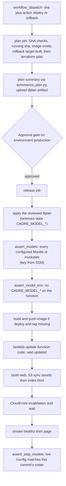

# CI/CD and deployment

Six workflows in `.github/workflows/`. The OIDC roles they assume — and their
invariants (e.g. `cadre-deploy` must never gain
`lambda:UpdateFunctionConfiguration`) — are in the
[Terraform page](/openwiki/infrastructure/terraform.md). Only one of them,
`Deploy`, mutates production (ADR 0003).

| Workflow | Triggers | What it does |
|---|---|---|
| `ci.yml` | PR, push to `main`, dispatch | Web typecheck/test/build, backend pytest, release-path tests, arm64 image build (no push), terraform fmt/validate. Never touches AWS. A manual dispatch can additionally run the backend `e2e` and Playwright `e2e-web` suites against a real target. |
| `deploy.yml` | `workflow_dispatch` only | The only production-mutating workflow: plans **and** applies Terraform, then ships the image + page for the same commit, behind the `production` approval gate (ADR 0003). |
| `terraform.yml` | PR touching `infra/**`, dispatch | Plan-only since ADR 0003 — read-only drift/review; the apply lives in `Deploy`. |
| `diff-honesty-scanner.yml` | Every PR into `main` | 12-rule scanner FAILs PRs whose diff weakens the safety net; self-tests first, waivers via `honesty-waiver:` PR-body lines (#86). |
| `docs.yml` | Push touching `docs/**`, `mkdocs.yml`, `adr/**`, dispatch | Builds the MkDocs site with `--strict`, publishes to GitHub Pages. |
| `openwiki-update.yml` | Daily schedule + dispatch | Regenerates this OpenWiki wiki and opens an auto-merged PR. |

## ci.yml — the gate

Five push/PR jobs — `web` (Node 22 — the `web/dist` artifact is
inspection-only; deploy rebuilds from source), `backend` (Python 3.13,
`pytest -q`), `release-path` (`pytest .github/tests/` — pins that `Deploy`'s
approval gate stays unconditional and the apply consumes the reviewed plan),
`image` (QEMU + Buildx arm64, `push: false` — catches a broken Dockerfile
pre-deploy), `terraform` (fmt `-check`, validate) — plus two **manual-only
jobs**. `e2e` runs the backend suite against a real target (defaults to
`https://cadre.marcuss.pro`) and `e2e-web` drives the page in real Chromium
(`web/e2e/`, Playwright); both cost real Bedrock turns, so they only fire on
dispatch with `run_e2e: true` (issue #27). Neither needs OIDC — since ADR 0002
nothing in the suites is AWS-authenticated — and the live-model cases read the
key from the `BEDROCK_API_KEY` repo secret (created out of band), skipping
with a loud `::warning::` if it's missing. Forcing `e2e_live_bedrock` also
runs `scripts/assert_models` first. **Nothing on push boots the container** —
the post-deploy `/healthz` smoke is the first real boot.

## deploy.yml — one gated release path (ADR 0003)

Dispatch-only on purpose: the approval gate would be meaningless if a merge
could fire it. Inputs: `action` (`deploy` | `rollback`) and a full 40-char
`sha`. This is the *only* workflow that can change production — it plans and
applies Terraform for the same commit it ships, so infra and code cannot drift
apart the way they did in #84.

- The **plan job** runs *before* the gate and mutates nothing: SHA format,
  existence, `git merge-base --is-ancestor` against `origin/main` — only
  merged commits are deployable — then what is running now, whether the target
  image exists, that a rollback target is already built (ECR keeps 10 images),
  then a Terraform plan under `cadre-terraform`, summarised for the approver
  by `.github/scripts/summarize_plan.py` and uploaded as the
  `tfplan-<run_id>` artifact.
- The **release job** applies that exact plan first (a stale or hand-set
  `CADRE_MODEL_*` is removed by the apply, which is why the drift gate runs
  *after* it), then `assert_models` (ids invokable, key fetched from SSM,
  never echoed), then `assert_model_env` (no `CADRE_MODEL_*` on the function),
  then pushes the image only when the immutable tag is missing (idempotent),
  `update-function-code`, web build + S3 sync — assets first (`immutable`),
  `index.html` last (`max-age=0`), no `--delete` — invalidation, smoke
  `/healthz` then `/`, and finally `assert_step_models` against the live
  `/config`. All three model gates run on rollbacks too — a rollback restores
  code, not account state, and every model step fails open (KB-009). Never
  `cp --metadata-directive REPLACE` (wipes Content-Type).
- The `production` gate is **inert until configured** — see
  `.github/DEPLOYMENT.md`.

## terraform.yml — plan-only (ADR 0003)

Plan runs on PR (`infra/**`) and dispatch, skipping cleanly when
`vars.TF_ROLE_ARN` is unset; it also prints current outputs so nobody needs
local credentials just to read a value. Since #93 it has no apply job and no
`production` environment — `Deploy` owns the apply. An infrastructure-only
change is simply a `Deploy` at the currently-running SHA: the image already
exists, so only the apply does any work. Known discrepancy: the plan-step
comment mentions `-detailed-exitcode` but the workflow doesn't pass it.

## diff-honesty-scanner.yml — the PR honesty gate

Runs on every PR into `main` with no path filter, so it cannot be dodged by
an "unrelated" file. The engine (`.github/scripts/diff_honesty_scanner.py`)
covers 12 rules — deleted/gutted tests, unconditional skips/`.only`/`xfail`,
tautological assertions, e2e-gate neutering (incl. secrets unwiring and
gate-default flips), suite narrowing, CI masking (`continue-on-error`,
`if: always()`, `|| true`, `--no-verify`), lint/type suppression, threshold
laundering, KB-entry deletion — and self-tests first: a PR that neuters a
detector fails the fixture suite before anything is scanned. Genuine false
positives are waived per finding with a `honesty-waiver: <rule> <path> — <reason>`
line in the PR body; `scanner-modified` is never waivable.

## docs.yml — the MkDocs site

`mkdocs build --strict` → GitHub Pages. `docs/infrastructure.md` and
`docs/adr/` include-markdown `infra/README.md` and `adr/` at build time
("copies drift; includes cannot") — hence the `adr/**` path filter.

## openwiki-update.yml — this wiki

Daily + dispatch. Checks out with `fetch-depth: 0` — a shallow clone hides the
commit OpenWiki last documented, so the update diffs against an empty change
summary. Opens an auto-merged PR touching `openwiki/`, `AGENTS.md`,
`CLAUDE.md`, and itself. This is the intended regeneration path — don't
hand-edit generated pages unless explicitly asked.
