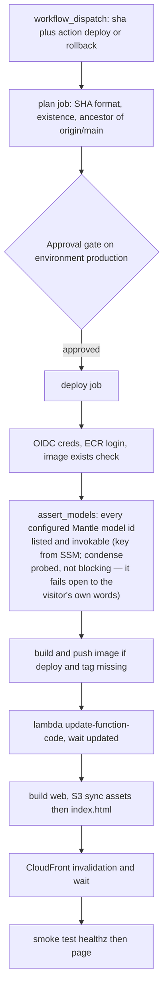

# CI/CD and deployment

Five workflows in `.github/workflows/`. The OIDC roles they assume — and their
invariants (e.g. `cadre-deploy` must never gain
`lambda:UpdateFunctionConfiguration`) — are in the
[Terraform page](/openwiki/infrastructure/terraform.md).

| Workflow | Triggers | What it does |
|---|---|---|
| `ci.yml` | PR, push to `main`, dispatch | Web typecheck/test/build, backend pytest, arm64 image build (no push), terraform fmt/validate. Never touches AWS. A manual dispatch can additionally run the e2e suite against a real target. |
| `deploy.yml` | `workflow_dispatch` only | Deploy or roll back to a chosen SHA, behind the `production` approval gate. |
| `terraform.yml` | PR touching `infra/**`, dispatch | Plan on PR/dispatch; apply on dispatch from the reviewed `tfplan` artifact. |
| `docs.yml` | Push touching `docs/**`, `mkdocs.yml`, `adr/**`, dispatch | Builds the MkDocs site with `--strict`, publishes to GitHub Pages. |
| `openwiki-update.yml` | Daily schedule + dispatch | Regenerates this OpenWiki wiki and opens an auto-merged PR. |

## ci.yml — the gate

Four push/PR jobs — `web` (Node 22 — the `web/dist` artifact is
inspection-only; deploy rebuilds from source), `backend` (Python 3.13,
`pytest -q`), `image` (QEMU + Buildx arm64, `push: false` — catches a broken
Dockerfile pre-deploy), `terraform` (fmt `-check`, validate) — plus a
**manual-only `e2e` job**. The e2e job never runs on push/PR: it hits a real
target (defaults to `https://cadre.marcuss.pro`) and costs real Bedrock turns,
so it only fires on dispatch with `run_e2e: true` (issue #27). It needs no
OIDC — since ADR 0002 nothing in the suite is AWS-authenticated. Three gates
control it: `CADRE_E2E_BEDROCK` (live-model cases, key from the
`BEDROCK_API_KEY` repo secret, created out of band, skipping with a loud
`::warning::` if missing), `CADRE_E2E_LANGFUSE` (trace read back
credential-free; the target must carry the `LANGFUSE_*` trio) and
`CADRE_E2E_KB` (grounded answers against the
[knowledge base](/openwiki/domain/knowledge-base.md); the target must carry
`OPENAI_API_KEY`).
Forcing `e2e_live_bedrock` also runs `scripts/assert_models` first. **Nothing
on push boots the container** — the post-deploy `/healthz` smoke is the first
real boot.

## deploy.yml — shipping is a decision

Dispatch-only on purpose: the approval gate would be meaningless if a merge
could fire it. Inputs: `action` (`deploy` | `rollback`) and a full 40-char `sha`.

- The **plan job** is credential-free and runs *before* the gate: SHA format,
  existence, `git merge-base --is-ancestor` against `origin/main` — only
  merged commits are deployable.
- The **deploy job** assumes `cadre-deploy`, then runs
  `scripts/assert_models.py` **before the build** (on rollbacks too — a
  rollback restores code, not account state): every model step fails open, so
  a wrong id would otherwise ship a working-looking chat with amber rails
  (KB-009). The key is fetched from SSM by the role, never echoed. Then it
  pushes the image only when the immutable tag is missing (idempotent),
  `update-function-code`, S3 sync — assets first (`immutable`), `index.html`
  last (`max-age=0`), no `--delete` — invalidation, smoke `/healthz` then
  `/`. Never `cp --metadata-directive REPLACE` (wipes Content-Type).
- The `production` gate is **inert until configured** — see
  `.github/DEPLOYMENT.md`.

## terraform.yml — plan on PR, apply from the artifact

Plan runs on PR (`infra/**`) and dispatch, skipping cleanly when
`vars.TF_ROLE_ARN` is unset. Apply is dispatch-only, in
`environment: production`, and applies the exact `tfplan-${{ github.run_id }}`
artifact — never re-plans, so moved state refuses rather than applying
something unreviewed. Known discrepancy: the plan-step comment mentions
`-detailed-exitcode` but the workflow doesn't pass it.

## docs.yml — the MkDocs site

`mkdocs build --strict` → GitHub Pages. `docs/infrastructure.md` and
`docs/adr/` include-markdown `infra/README.md` and `adr/` at build time
("copies drift; includes cannot") — hence the `adr/**` path filter.

## openwiki-update.yml — this wiki

Daily + dispatch. Checks out with `fetch-depth: 0` — a shallow clone hides the
commit OpenWiki last documented, so the update diffs against an empty change
summary. Opens an auto-merged PR touching `openwiki/`, `AGENTS.md`,
`CLAUDE.md`, and itself. This is the intended regeneration path — don't
hand-edit generated pages unless explicitly asked.
