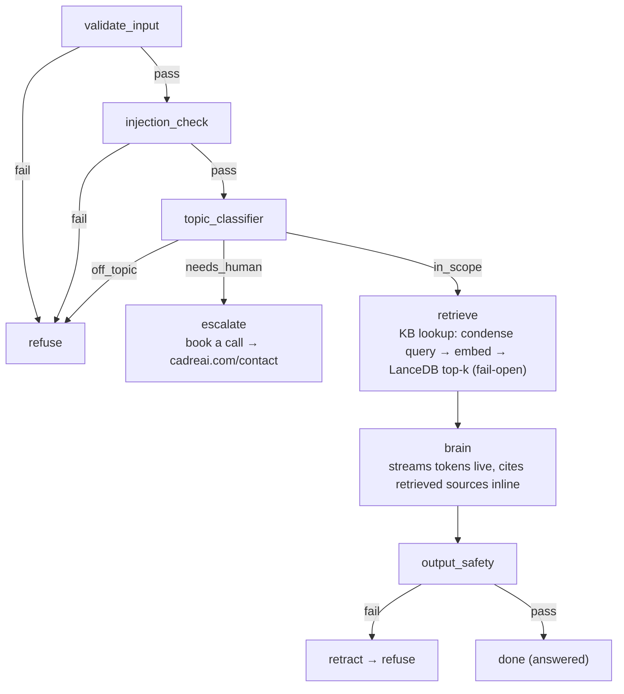

# plan.md — Cadre AI support chatbot

A customer-support chatbot for **Cadre AI** (AI strategy & implementation consultancy), live at **https://cadre.marcuss.pro**.

**Stack:** React/Vite SSE client → CloudFront → Lambda Function URL (response streaming) → FastAPI + **LangGraph** conversation engine → Bedrock models over the OpenAI-compatible **Mantle** endpoint (ADR 0002) → **Langfuse** for end-to-end tracing with public trace links. OpenAI embeddings + a committed LanceDB artifact power retrieval (Phase 3).

**This file is the epic.** Each phase below is broken down into GitHub issues (via `/compound-create-issue`) that carry the implementation detail; the issues reference their phase here. Process, board, and knowledge-base mechanics: see `CLAUDE.md`.

**Status (2026-08-08): Phases 1–3 are shipped and deployed. Phases 4–6 are designed below but NOT built** — where a section describes unshipped behavior (the eval harness, the feedback UI) it says so inline. `retrieve` is live: condense → embed → LanceDB search between `topic_classifier` and `brain`, fail-open with a per-cause `detail` on every give-up path.

## Foundations

Before this plan was written, a POC walking skeleton was built and deployed end-to-end to de-risk the delivery path: CloudFront ↔ Lambda Function URL ↔ SSE streaming (the traps found are recorded in ADR 0001), private S3 + OAC for the static client, CI/CD with Terraform, and a smoke-tested `POST /ask` pipeline. Alongside it, a minimal compound-engineering setup (`.claude/` skills, kanban board, `kb/learnings.json`, ADRs) was created so that every phase below compounds on recorded learnings. That scoping work directs this plan; everything from here is forward-only.

## Architecture — LangGraph conversation engine

The backend is orchestrated as a **LangGraph `StateGraph`** over a typed `ConversationState` (`message`, `history`, `client_id`, `steps[]`, `context`, `answer`, `outcome ∈ {answered, refused, escalated, error}`, `refusal_text`, `trace_url`). Every terminal is an explicit state; every transition is observable (SSE + Langfuse).

### Model roster — a fit-for-purpose model per step

The plan originally specced Claude models (Haiku judges, Opus brain) via `langchain-aws`/`ChatBedrockConverse`. Neither survived contact with the account: classic `bedrock-runtime` is `NOT_AUTHORIZED` account-wide and the Claude ids listed on the Mantle endpoint refuse to run (ADR 0002), so calls go over Mantle's OpenAI-compatible API via `httpx`, and every slot was **probed for reliability, accuracy-through-the-parser, and latency before pinning** (KB-012 — the first probe changed three of five slots; the measured quality pass of #70/#79 changed four more, with the benchmark tables in [docs/quality/cadre-ai-agent.md](https://nextasy-apps-llc.github.io/marcuss-cadre-test/quality/cadre-ai-agent/)). The roster below is what ships. `backend/app/config.py`'s `MODEL_DEFAULTS` is the single source of truth, and the image is its only carrier (issue #84): Terraform sets no `CADRE_MODEL_*`, three deploy gates fail on drift, and the env vars survive only as hand-set break-glass.

| Step | Model (shipped) | Why |
|---|---|---|
| input validation | deterministic checks + **`nvidia.nemotron-nano-12b-v2`** | cheap SLM sanity/validity judge behind fail-open |
| injection check | **`mistral.ministral-3-8b-instruct`** strict single-token classifier | 100% on the labelled injection fixtures at p50 0.17s (#70); the meta-complaint carve-out lives in the prompt, with positive fixtures pinning that real injections still fire |
| topic classifier | **`mistral.ministral-3-8b-instruct`** (fallbacks, walked on model *errors* only: `zai.glm-4.7-flash`, then `qwen.qwen3-next-80b-a3b-instruct`) | 3-way route `in_scope` / `off_topic` / `needs_human`; 100% on the labelled conversations at p50 0.19s (#70) — every Nemotron under-scored it |
| query condensing | **`google.gemma-3-12b-it`** | rewrite follow-ups into standalone retrieval queries (skipped entirely on a first message). Probed before pinning: 10/10 usable rewrites, p50 0.39s, and condensing lifts the mean top-hit score on 5 real follow-ups from 0.250 to 0.602 — "how much does that cost?" alone retrieves nothing at all |
| brain | **`qwen.qwen3-32b`** (streaming) | the specced Opus cannot run through Mantle (ADR 0002); qwen3-32b answers nuanced consulting questions well inside the 60s turn budget |
| output safety | **`nvidia.nemotron-nano-3-30b`** guard + deterministic PII/URL scrub | swapped from qwen3-next-80b in #79 for −56% step cost; the one known 3-point fixture regression is documented, watched on every trace, and revertible without a code deploy |
| embeddings | **OpenAI `text-embedding-3-large`** (3072 native) | KB requirement; on a corpus this small the cost difference is noise and retrieval quality is the only axis that matters (decision recorded in #62, superseding `-3-small`) |

## SSE protocol v2 — real-time through every phase

The FastAPI endpoint bridges the graph to SSE via an asyncio queue; node wrappers emit events as the graph advances, so the client renders the pipeline live:

- `state` — `{step, status: running | pass | fail | skipped, detail?, elapsed_ms, retrieval}` on **every** transition (`elapsed_ms` is set on `pass`/`fail` verdicts and reused verbatim as the trace's per-step latency, so stepper and trace cannot disagree; `retrieval {query, hit_count, top_score}` rides `retrieve`'s terminal `pass` only — #74)
- `token` — brain deltas, streamed as generated
- `trace` — `{trace_id, url}`, the first frame of the turn (the id is generated locally, so the URL is known before the graph starts); absent entirely when tracing is down
- `done` — `{outcome, refusal_text?}` · `error` · `: ping` comment heartbeat (idle-timeout safety)

Canonical definition: `backend/app/sse.py`, mirrored verbatim in `web/src/types.ts` — full semantics in `backend/CLAUDE.md`.

Stream-then-retract is explicit: tokens stream during `brain`; a later `output_safety` fail instructs the client to replace the streamed buffer with `refusal_text`, this is non ideal for a production grade chatbot but it is ideal for this submission since it shows the whole process.

## Traceability — Langfuse

Shipped in Phase 2 (PR #55). The whole surface is `backend/app/tracing.py`; the rules it must obey (per-request `CallbackHandler` on `config["callbacks"]`, double-flush ordering, flush-before-terminal because Lambda freezes on response end, fail-open) live in `backend/CLAUDE.md` — read that, not this, before touching tracing. The shape in brief:

- Langfuse Cloud; the SDK's LangChain `CallbackHandler` rides every graph invocation, so each **node** lands as a span. Individual Bedrock calls **are** captured as hand-built generations carrying the effective model id, token usage and cost (`trace-design.md` §4.2, issue #79) — the model path is still plain `httpx` with no LangChain in it (ADR 0002); the observations are constructed by hand in the transport, because the model id and the token counts exist nowhere else.
- A locally generated trace id lets the backend emit the trace URL as the **first** SSE frame; the trace is marked public, so the link opens without a login.
- The web client renders a **"View trace ↗"** chip on each traced assistant message.
- Trade-off, accepted for a demo: public traces expose user messages. Called out under scope.

## Knowledge base (RAG) — when and how the bot consults it *(Phase 3 — shipped, #62)*

**The KB is consulted on every in-scope user message, as a first-class LangGraph node (`retrieve`)** — the standard LangGraph RAG pattern (retrieval as a graph step, not a hidden call inside the brain). It runs **after `topic_classifier` passes and before `brain`**: refused/escalated messages never spend an embedding call, and the brain always has its context before generating. As a node it gets its own SSE `state` events (`retrieve: running → pass/skipped`) and its own Langfuse span (query, top-k hits, scores — all visible in the public trace).

Inside `retrieve`:
1. **Query condensing** (multi-turn): with non-empty history, Gemma 3 12B rewrites the message into a standalone query ("how much does *that* cost?" → "Cadre AI Maturity Index pricing"). With empty history the call is skipped entirely — a first message is already standalone, and confirming that would spend part of the 60s turn budget on a no-op.
2. Embed the query with OpenAI `text-embedding-3-large` — the same model at the same 3072 dimensions the artifact was built with. A mismatch does not raise, it returns wrong neighbours, so `retrieve` checks the query vector against `app/kb/manifest.json` before it searches.
3. Vector search top-k≈6 with a similarity floor; hits (chunk text + source title/URL) are injected into the brain prompt with an instruction to cite sources inline as a simple small "see more" link at the end that when clicked takes you the original http, it should not show the long url.
4. **Fail-open**: an embeddings/DB outage degrades to persona-baseline answers; the `state` event reports `retrieve: skipped`, never a user-facing error. Each way of giving up is its own machine-readable `detail` — `kb_unavailable`, `kb_disabled`, `kb_dimension_mismatch`, `kb_timeout` — because "the KB is off" and "the KB is answering from the wrong corpus" need different people woken up. Zero hits is a `pass`/`no_hits`, not a skip: the KB ran, it had nothing.

### KB infrastructure — embedded LanceDB, not a database server

The corpus is ~50 pages / a few hundred chunks. The right-sized store is **LanceDB**: a real vector DB, but serverless/embedded — a columnar Lance dataset opened in-process by the Lambda. The ingestion output `backend/app/kb/cadre_kb.lance/` is committed and baked into the Docker image; queries are millisecond-local with zero cold-start dependency and $0 infra.

**Postgres + pgvector was considered and deliberately deferred**: it needs an always-on RDS/Aurora instance and a VPC-attached Lambda (NAT cost, slower cold starts) to serve a corpus that fits in memory. It becomes the right answer when the corpus grows large, updates frequently, or goes multi-tenant — listed under "with more time". If LanceDB misbehaves inside Lambda, **sqlite-vec** is the drop-in fallback (same embedded shape).

### Ingestion pipeline

`backend/ingest/` runs locally (never in Lambda): fetch a **frozen 55-URL allowlist** of `www.cadreai.com` pages — home, about, contact, case-studies, events, the 4 service pages, industries (×9 — the sitemap has nine, not eight) and departments (×8), plus all 27 `/articles/*` — one request per second, honest User-Agent, `robots.txt` enforced, never following a link. Extract main content (beautifulsoup4 + lxml), drop the blocks every page shares (this site's footer is `
`s, so the tag list alone leaves the menu in the corpus), chunk ~800 tokens with ~100 overlap and heading/URL metadata, embed with `text-embedding-3-large`, write the LanceDB dataset and a manifest recording model, dimension and counts. Refresh = re-run the script and commit the artifact; automated re-ingestion is an explicit non-goal.

As built (2026-08-08): 55 pages → 131 chunks (median 755 tokens), a 1.80 MB committed artifact, 85K embedding tokens ≈ $0.011 per full rebuild. Details in `backend/ingest/README.md`.

## Frontend — real-time state UI

- **Pipeline stepper**: live per-step chips (pending → running → pass/fail/skipped) driven by `state` events — the guardrail pipeline is visible, not implied.
- Streaming transcript; on refusal the client replaces the streamed buffer using `refusal_text`.
- Safe URL linkification (text→anchor for `https://` matches only; no `dangerouslySetInnerHTML`) so citations and the booking link are clickable.
- "View trace ↗" chip on the latest assistant message.
- Suggestion chips + greeting covering the assignment's support scenarios.
- **Thumbs up / thumbs down — NOT built** (Phase 5). The intent is a deliberate no-op UI: buttons that appear (with a brief "thanks" acknowledgment) but are wired to nothing, documenting the feedback loop; recording them as Langfuse scores is listed under "with more time". Today there is no feedback UI at all.

## Persona (brain node)

Cadre AI support assistant for prospective and existing clients: services (AI Strategy, AI Leadership & Facilitation, AI Engineering, AI Agents), industries served, the AI Maturity Index, the client portal, and how to get started. Facts come only from retrieved context and the vetted baseline — never invented pricing, clients, or capabilities. Pricing → engagements are custom; book a strategy call. Unknown or out-of-scope → escalate to https://www.cadreai.com/contact. Replies in the user's language.

## Evaluation — LLM-as-judge *(Phase 4 — designed, not built; `backend/evals/` today holds the narrower judge-slot benchmark, not this harness)*

"Is the bot doing things correctly, and did this change make it better or worse?" is answered by an **offline eval harness** (`backend/evals/`) that runs the LangGraph engine headless against a golden dataset and logs every run as a **Langfuse experiment**, so run-vs-run comparison (per-case and aggregate score deltas) comes from Langfuse's native experiment UI — no dashboard to build.

- **Golden dataset (~30 cases, growable)**: the assignment's support scenarios plus adversarial ones — off-topic, injection attempts, multi-turn follow-ups, pricing, unknown-answer escalation. Each case: input (+history) → expected `outcome` (`answered/refused/escalated`), expected source URL for grounded questions, and a reference answer. Stored in-repo; mirrored to a Langfuse dataset.
- **Deterministic assertions first** (no LLM, exact): the injection case got `refused`; the unknown case `escalated` with the booking link; the grounded answer cites the expected page.
- **LLM-as-judge for the fuzzy half**: rubric grading of groundedness (only claims supported by the retrieved chunks — the hallucination check), correctness vs the reference answer, and persona/tone adherence. **Reference-guided grading** blunts self-preference bias, and the judge is a **different model family from the brain**, picked by measurement the way every slot already is — `backend/evals/judge_bench.py` takes its candidates per run (`--models` is required, no default list), same Mantle endpoint, so no new infra.
- **When it runs**: manually or via `workflow_dispatch` before merging any prompt, model, or retrieval change. A full run costs cents and a few minutes. CI *gating* on scores is deliberately deferred (see scope) — judge scores need calibration before they're allowed to block merges.

## Phases

- [x] **Phase 1 — LangGraph engine + SSE v2**: `StateGraph`, nodes with mocked-seam unit tests, `state` events, refusal/escalation states, persona v1, frontend protocol update + pipeline stepper. — shipped via #24/#25/#26/#27 (PRs #29, #31, #35)
- [x] **Phase 2 — Langfuse traceability**: keys via SSM SecureString (`SET_OUT_OF_BAND` pattern), callback wiring, public traces, `trace` event, frontend trace link, flush hardening for Lambda.
- [x] **Phase 3 — RAG KB**: ingestion pipeline + committed LanceDB artifact (55 pages → 131 chunks, 1.80 MB); `retrieve` node (condense → embed → search) wired between `topic_classifier` and `brain`, fail-open with per-cause `detail`s and its own Langfuse span; cited answers via `persona.system_prompt(context)`; OpenAI key `data`-read from SSM into the function (`infra/openai.tf`); linkify verified end to end in a real browser against the real backend image (KB-007, KB-017). — shipped and deployed via #62; refined by #67 (INIT-phase warm-up), #70 (quality pass), #74 (retrieval facts on the wire), #79 (trace generations + cost)
- [ ] **Phase 4 — Evaluation harness**: golden dataset; headless graph runner; deterministic outcome/citation assertions; LLM-judge rubric (groundedness, correctness, persona) on a non-brain model family; runs logged as Langfuse experiments for before/after comparison. *(Not built. What exists today is narrower: `backend/evals/judge_bench.py` benchmarks candidate models for the three judge slots over labelled regression fixtures.)*
- [ ] **Phase 5 — UX polish + e2e**: stepper/linkify/suggestions polish; no-op thumbs up/down. *(The e2e half shipped early and grew past this spec: `backend/tests/e2e/` — 57 `BASE_URL`-pointable tests with three opt-in live gates — and the Playwright `web/e2e/` browser suite, #85. The thumbs and polish remain unbuilt.)*
- [ ] **Phase 6 — Hardening + live verification**: the assignment's support scenarios exercised live in a browser, including escalation and trace-link click-through; a final eval run recorded as the submission baseline. *(The 98-question sweep of 2026-08-08 in `docs/quality/cadre-ai-agent.md` is a partial baseline; the final live pass has not been run.)*

## Scope decisions

**In scope:** the assignment's support scenarios; grounded, cited answers via RAG (Phase 3, shipped — whenever retrieval fails open, facts fall back to the vetted persona baseline); the six-step guarded pipeline with live visible state; public per-turn traces; escalation to a human via booking; an offline LLM-as-judge eval harness with run-vs-run comparison (Phase 4, not built).

**Out of scope** (each deliberate, with the "with more time" path):

| Deferred | Why now | With more time |
|---|---|---|
| Auth / user accounts | demo is anonymous | Cognito in front of CloudFront |
| CRM/ticket handoff on escalation | no CRM to integrate against | webhook to HubSpot/Zendesk from the `escalate` node |
| Conversation persistence | in-request history covers the demo | DynamoDB session store keyed by client id |
| Analytics dashboard | Langfuse already captures per-trace data | Langfuse dashboards / metrics API |
| Distributed rate limiting | single-Lambda in-process limiter suffices | DynamoDB token bucket |
| Automated KB re-ingestion | corpus changes rarely | scheduled ingestion + freshness checks |
| pgvector/RDS-backed KB | corpus fits in an embedded store | migrate when corpus scale/tenancy demands it |
| Langfuse self-hosting | Cloud free tier fits a demo | self-host if data residency requires |
| Public traces privacy | acceptable for a demo | per-conversation opt-in, redaction in traces |
| User feedback wiring | no feedback UI built yet; the no-op thumbs are Phase 5 | record as Langfuse scores on the message's trace; feed the eval dataset |
| Online / continuous evaluation | offline harness covers the demo | scheduled LLM-judge over sampled production traces; drift alerts |
| CI gating on eval scores | judge needs calibration first | block merges on score regression once judge↔human agreement is measured |

## Operational notes

- Secrets live in SSM. Two shapes, and picking the wrong one clobbers a live value: parameters that don't exist yet are created by Terraform with `value = "SET_OUT_OF_BAND"` + `ignore_changes` (none currently); parameters that already exist with real values (the Bedrock key, the three Langfuse parameters, the OpenAI key) are only `data`-referenced. `infra/README.md` § "Secrets and credentials" is the canonical write-up.
- Model ids are gated three times before they run — `backend/scripts/assert_models.py` (entitlement: `GET /v1/models` *and* a real one-token completion per id, because listing is not entitlement), `assert_model_env.py` (no `CADRE_MODEL_*` drift on the live function), `assert_step_models.py` (the deployed `/config` matches the commit's own defaults) — all wired into `deploy.yml`, none skippable.
- Shipping is a decision, not a merge side effect: one approval-gated **`Deploy`** workflow plans and applies the commit's Terraform, then ships its image and page in the same run (ADR 0003). Every phase merges deployable.
